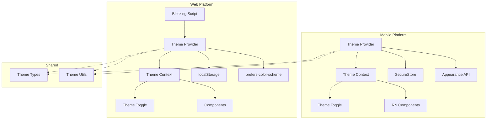
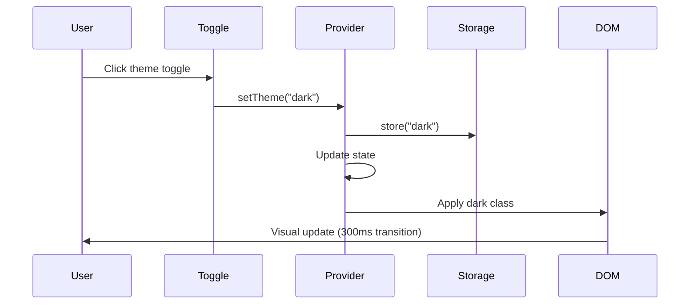

# Design Document: Dark/Light Theme System

## Overview

This design implements a comprehensive dark/light theme system for MS Oto Servis across web (Next.js 15) and mobile (Expo React Native) platforms. The system provides seamless theme switching with persistence, SSR support, system preference detection, and accessibility compliance.

### Key Design Goals

1. **Zero Flash of Incorrect Theme (FOIT)**: Blocking script ensures correct theme before first paint
2. **Cross-Platform Consistency**: Unified theme logic for web and mobile
3. **Performance**: <50ms theme switching, CSS custom properties for efficient updates
4. **Accessibility**: WCAG AA compliance for all color combinations
5. **Developer Experience**: Simple API, type-safe theme tokens, easy component integration

### Architecture Principles

- **Separation of Concerns**: Storage, detection, and application logic are decoupled
- **Progressive Enhancement**: Works without JavaScript (respects system preference via CSS)
- **Single Source of Truth**: Theme state managed in React Context
- **Platform Abstraction**: Storage layer abstracts localStorage (web) vs SecureStore (mobile)

## Architecture

### High-Level Architecture



### Component Hierarchy

```
Web App:
├── app/layout.tsx (root)
│   ├── <html> with blocking script
│   └── <ThemeProvider>
│       ├── Dashboard Layout
│       │   └── <ThemeToggle />
│       ├── Super Admin Layout
│       │   └── <ThemeToggle />
│       └── Public Pages
│           └── <ThemeToggle />

Mobile App:
├── app/_layout.tsx (root)
│   └── <ThemeProvider>
│       ├── (firma) Layout
│       │   └── Settings with <ThemeToggle />
│       └── (musteri) Layout
│           └── Settings with <ThemeToggle />
```

### Data Flow



## Components and Interfaces

### 1. Theme Types and Constants

**Location**: `apps/web/lib/theme/types.ts` and `apps/mobile/lib/theme/types.ts`

```typescript
// Shared types
export type ThemeMode = "light" | "dark";
export type ThemePreference = ThemeMode | "system";

export interface ThemeContextValue {
  theme: ThemeMode;
  preference: ThemePreference;
  setPreference: (preference: ThemePreference) => void;
  isLoading: boolean;
}

export const THEME_STORAGE_KEY = "ms-otoservis-theme";
export const THEME_MODES: ThemeMode[] = ["light", "dark"];
export const THEME_PREFERENCES: ThemePreference[] = ["system", "light", "dark"];
```

### 2. Theme Storage Abstraction

**Location**: `apps/web/lib/theme/storage.ts`

```typescript
export interface ThemeStorage {
  get(): ThemePreference | null;
  set(preference: ThemePreference): void;
  remove(): void;
}

export class LocalStorageThemeStorage implements ThemeStorage {
  private key = THEME_STORAGE_KEY;
  
  get(): ThemePreference | null {
    try {
      const value = localStorage.getItem(this.key);
      if (value && THEME_PREFERENCES.includes(value as ThemePreference)) {
        return value as ThemePreference;
      }
      return null;
    } catch {
      return null;
    }
  }
  
  set(preference: ThemePreference): void {
    try {
      localStorage.setItem(this.key, preference);
    } catch (error) {
      console.error("Failed to save theme preference:", error);
    }
  }
  
  remove(): void {
    try {
      localStorage.removeItem(this.key);
    } catch {
      // Silent fail
    }
  }
}
```

**Location**: `apps/mobile/lib/theme/storage.ts`

```typescript
import * as SecureStore from "expo-secure-store";

export class SecureStoreThemeStorage implements ThemeStorage {
  private key = THEME_STORAGE_KEY;
  
  async get(): Promise<ThemePreference | null> {
    try {
      const value = await SecureStore.getItemAsync(this.key);
      if (value && THEME_PREFERENCES.includes(value as ThemePreference)) {
        return value as ThemePreference;
      }
      return null;
    } catch {
      return null;
    }
  }
  
  async set(preference: ThemePreference): Promise<void> {
    try {
      await SecureStore.setItemAsync(this.key, preference);
    } catch (error) {
      console.error("Failed to save theme preference:", error);
    }
  }
  
  async remove(): Promise<void> {
    try {
      await SecureStore.deleteItemAsync(this.key);
    } catch {
      // Silent fail
    }
  }
}
```

### 3. System Preference Detection

**Location**: `apps/web/lib/theme/system-preference.ts`

```typescript
export function getSystemPreference(): ThemeMode {
  if (typeof window === "undefined") return "light";
  
  return window.matchMedia("(prefers-color-scheme: dark)").matches
    ? "dark"
    : "light";
}

export function subscribeToSystemPreference(
  callback: (theme: ThemeMode) => void
): () => void {
  if (typeof window === "undefined") return () => {};
  
  const mediaQuery = window.matchMedia("(prefers-color-scheme: dark)");
  
  const handler = (e: MediaQueryListEvent) => {
    callback(e.matches ? "dark" : "light");
  };
  
  mediaQuery.addEventListener("change", handler);
  
  return () => mediaQuery.removeEventListener("change", handler);
}
```

**Location**: `apps/mobile/lib/theme/system-preference.ts`

```typescript
import { Appearance } from "react-native";

export function getSystemPreference(): ThemeMode {
  const colorScheme = Appearance.getColorScheme();
  return colorScheme === "dark" ? "dark" : "light";
}

export function subscribeToSystemPreference(
  callback: (theme: ThemeMode) => void
): () => void {
  const subscription = Appearance.addChangeListener(({ colorScheme }) => {
    callback(colorScheme === "dark" ? "dark" : "light");
  });
  
  return () => subscription.remove();
}
```

### 4. Theme Resolution Logic

**Location**: `apps/web/lib/theme/resolver.ts` and `apps/mobile/lib/theme/resolver.ts`

```typescript
export function resolveTheme(
  preference: ThemePreference,
  systemPreference: ThemeMode
): ThemeMode {
  if (preference === "system") {
    return systemPreference;
  }
  return preference;
}

export function validateThemePreference(
  value: unknown
): ThemePreference | null {
  if (typeof value === "string" && THEME_PREFERENCES.includes(value as ThemePreference)) {
    return value as ThemePreference;
  }
  return null;
}
```

### 5. Theme Provider (Web)

**Location**: `apps/web/components/theme-provider.tsx`

```typescript
"use client";

import { createContext, useContext, useEffect, useState, useCallback } from "react";
import type { ThemeContextValue, ThemeMode, ThemePreference } from "@/lib/theme/types";
import { LocalStorageThemeStorage } from "@/lib/theme/storage";
import { getSystemPreference, subscribeToSystemPreference } from "@/lib/theme/system-preference";
import { resolveTheme } from "@/lib/theme/resolver";

const ThemeContext = createContext<ThemeContextValue | undefined>(undefined);

const storage = new LocalStorageThemeStorage();

export function ThemeProvider({ children }: { children: React.ReactNode }) {
  const [preference, setPreferenceState] = useState<ThemePreference>("system");
  const [systemPreference, setSystemPreference] = useState<ThemeMode>("light");
  const [isLoading, setIsLoading] = useState(true);
  
  const theme = resolveTheme(preference, systemPreference);
  
  // Initialize theme from storage
  useEffect(() => {
    const storedPreference = storage.get();
    const initialSystemPreference = getSystemPreference();
    
    setSystemPreference(initialSystemPreference);
    
    if (storedPreference) {
      setPreferenceState(storedPreference);
    }
    
    setIsLoading(false);
  }, []);
  
  // Subscribe to system preference changes
  useEffect(() => {
    const unsubscribe = subscribeToSystemPreference((newSystemPreference) => {
      setSystemPreference(newSystemPreference);
    });
    
    return unsubscribe;
  }, []);
  
  // Apply theme to DOM
  useEffect(() => {
    const root = document.documentElement;
    
    if (theme === "dark") {
      root.classList.add("dark");
    } else {
      root.classList.remove("dark");
    }
  }, [theme]);
  
  const setPreference = useCallback((newPreference: ThemePreference) => {
    setPreferenceState(newPreference);
    storage.set(newPreference);
  }, []);
  
  return (
    <ThemeContext.Provider value={{ theme, preference, setPreference, isLoading }}>
      {children}
    </ThemeContext.Provider>
  );
}

export function useTheme(): ThemeContextValue {
  const context = useContext(ThemeContext);
  if (!context) {
    throw new Error("useTheme must be used within ThemeProvider");
  }
  return context;
}
```

### 6. Theme Provider (Mobile)

**Location**: `apps/mobile/components/theme-provider.tsx`

```typescript
import { createContext, useContext, useEffect, useState, useCallback } from "react";
import type { ThemeContextValue, ThemeMode, ThemePreference } from "@/lib/theme/types";
import { SecureStoreThemeStorage } from "@/lib/theme/storage";
import { getSystemPreference, subscribeToSystemPreference } from "@/lib/theme/system-preference";
import { resolveTheme } from "@/lib/theme/resolver";

const ThemeContext = createContext<ThemeContextValue | undefined>(undefined);

const storage = new SecureStoreThemeStorage();

export function ThemeProvider({ children }: { children: React.ReactNode }) {
  const [preference, setPreferenceState] = useState<ThemePreference>("system");
  const [systemPreference, setSystemPreference] = useState<ThemeMode>("light");
  const [isLoading, setIsLoading] = useState(true);
  
  const theme = resolveTheme(preference, systemPreference);
  
  // Initialize theme from storage
  useEffect(() => {
    (async () => {
      const storedPreference = await storage.get();
      const initialSystemPreference = getSystemPreference();
      
      setSystemPreference(initialSystemPreference);
      
      if (storedPreference) {
        setPreferenceState(storedPreference);
      }
      
      setIsLoading(false);
    })();
  }, []);
  
  // Subscribe to system preference changes
  useEffect(() => {
    const unsubscribe = subscribeToSystemPreference((newSystemPreference) => {
      setSystemPreference(newSystemPreference);
    });
    
    return unsubscribe;
  }, []);
  
  const setPreference = useCallback((newPreference: ThemePreference) => {
    setPreferenceState(newPreference);
    storage.set(newPreference);
  }, []);
  
  return (
    <ThemeContext.Provider value={{ theme, preference, setPreference, isLoading }}>
      {children}
    </ThemeContext.Provider>
  );
}

export function useTheme(): ThemeContextValue {
  const context = useContext(ThemeContext);
  if (!context) {
    throw new Error("useTheme must be used within ThemeProvider");
  }
  return context;
}
```

### 7. Blocking Script for SSR

**Location**: `apps/web/components/theme-script.tsx`

```typescript
import { THEME_STORAGE_KEY } from "@/lib/theme/types";

export function ThemeScript() {
  const script = `
    (function() {
      try {
        var key = '${THEME_STORAGE_KEY}';
        var preference = localStorage.getItem(key) || 'system';
        var theme = preference;
        
        if (preference === 'system') {
          theme = window.matchMedia('(prefers-color-scheme: dark)').matches ? 'dark' : 'light';
        }
        
        if (theme === 'dark') {
          document.documentElement.classList.add('dark');
        }
      } catch (e) {}
    })();
  `;
  
  return (
    <script
      dangerouslySetInnerHTML={{ __html: script }}
      suppressHydrationWarning
    />
  );
}
```

### 8. Theme Toggle Component (Web)

**Location**: `apps/web/components/ui/theme-toggle.tsx`

```typescript
"use client";

import { Moon, Sun, Monitor } from "lucide-react";
import { useTheme } from "@/components/theme-provider";
import { Button } from "@/components/ui/button";
import {
  DropdownMenu,
  DropdownMenuContent,
  DropdownMenuItem,
  DropdownMenuTrigger,
} from "@/components/ui/dropdown-menu";
import { useTranslations } from "next-intl";

export function ThemeToggle() {
  const { preference, setPreference } = useTheme();
  const t = useTranslations("theme");
  
  return (
    <DropdownMenu>
      <DropdownMenuTrigger asChild>
        <Button variant="ghost" size="icon" aria-label={t("toggleTheme")}>
          <Sun className="h-5 w-5 rotate-0 scale-100 transition-all dark:-rotate-90 dark:scale-0" />
          <Moon className="absolute h-5 w-5 rotate-90 scale-0 transition-all dark:rotate-0 dark:scale-100" />
          <span className="sr-only">{t("toggleTheme")}</span>
        </Button>
      </DropdownMenuTrigger>
      <DropdownMenuContent align="end">
        <DropdownMenuItem
          onClick={() => setPreference("light")}
          className={preference === "light" ? "bg-accent" : ""}
        >
          <Sun className="mr-2 h-4 w-4" />
          <span>{t("light")}</span>
        </DropdownMenuItem>
        <DropdownMenuItem
          onClick={() => setPreference("dark")}
          className={preference === "dark" ? "bg-accent" : ""}
        >
          <Moon className="mr-2 h-4 w-4" />
          <span>{t("dark")}</span>
        </DropdownMenuItem>
        <DropdownMenuItem
          onClick={() => setPreference("system")}
          className={preference === "system" ? "bg-accent" : ""}
        >
          <Monitor className="mr-2 h-4 w-4" />
          <span>{t("system")}</span>
        </DropdownMenuItem>
      </DropdownMenuContent>
    </DropdownMenu>
  );
}
```

### 9. Theme Toggle Component (Mobile)

**Location**: `apps/mobile/components/theme-toggle.tsx`

```typescript
import { View, Text, TouchableOpacity, StyleSheet } from "react-native";
import { useTheme } from "@/components/theme-provider";
import type { ThemePreference } from "@/lib/theme/types";

const THEME_OPTIONS: { value: ThemePreference; label: string; icon: string }[] = [
  { value: "system", label: "Sistem", icon: "💻" },
  { value: "light", label: "Açık", icon: "☀️" },
  { value: "dark", label: "Koyu", icon: "🌙" },
];

export function ThemeToggle() {
  const { preference, setPreference, theme } = useTheme();
  
  return (
    <View style={styles.container}>
      <Text style={[styles.label, theme === "dark" && styles.labelDark]}>
        Tema
      </Text>
      <View style={styles.options}>
        {THEME_OPTIONS.map((option) => (
          <TouchableOpacity
            key={option.value}
            style={[
              styles.option,
              theme === "dark" && styles.optionDark,
              preference === option.value && styles.optionActive,
              preference === option.value && theme === "dark" && styles.optionActiveDark,
            ]}
            onPress={() => setPreference(option.value)}
            accessibilityRole="button"
            accessibilityLabel={`${option.label} tema`}
            accessibilityState={{ selected: preference === option.value }}
          >
            <Text style={styles.icon}>{option.icon}</Text>
            <Text
              style={[
                styles.optionText,
                theme === "dark" && styles.optionTextDark,
                preference === option.value && styles.optionTextActive,
              ]}
            >
              {option.label}
            </Text>
          </TouchableOpacity>
        ))}
      </View>
    </View>
  );
}

const styles = StyleSheet.create({
  container: {
    padding: 16,
  },
  label: {
    fontSize: 16,
    fontWeight: "600",
    marginBottom: 12,
    color: "#000",
  },
  labelDark: {
    color: "#fff",
  },
  options: {
    flexDirection: "row",
    gap: 12,
  },
  option: {
    flex: 1,
    flexDirection: "column",
    alignItems: "center",
    padding: 12,
    borderRadius: 8,
    borderWidth: 2,
    borderColor: "#e5e7eb",
    backgroundColor: "#fff",
  },
  optionDark: {
    borderColor: "#374151",
    backgroundColor: "#1f2937",
  },
  optionActive: {
    borderColor: "#3b82f6",
    backgroundColor: "#eff6ff",
  },
  optionActiveDark: {
    borderColor: "#3b82f6",
    backgroundColor: "#1e3a8a",
  },
  icon: {
    fontSize: 24,
    marginBottom: 4,
  },
  optionText: {
    fontSize: 14,
    fontWeight: "500",
    color: "#000",
  },
  optionTextDark: {
    color: "#fff",
  },
  optionTextActive: {
    color: "#3b82f6",
  },
});
```

## Data Models

### Theme Preference Storage

**Web (localStorage)**:
```
Key: "ms-otoservis-theme"
Value: "light" | "dark" | "system"
```

**Mobile (SecureStore)**:
```
Key: "ms-otoservis-theme"
Value: "light" | "dark" | "system"
```

### CSS Custom Properties

**Location**: `apps/web/app/globals.css`

```css
@tailwind base;
@tailwind components;
@tailwind utilities;

@layer base {
  :root {
    /* Light mode colors */
    --background: 0 0% 100%;
    --foreground: 222.2 84% 4.9%;
    --card: 0 0% 100%;
    --card-foreground: 222.2 84% 4.9%;
    --popover: 0 0% 100%;
    --popover-foreground: 222.2 84% 4.9%;
    --primary: 221.2 83.2% 53.3%;
    --primary-foreground: 210 40% 98%;
    --secondary: 210 40% 96.1%;
    --secondary-foreground: 222.2 47.4% 11.2%;
    --muted: 210 40% 96.1%;
    --muted-foreground: 215.4 16.3% 46.9%;
    --accent: 210 40% 96.1%;
    --accent-foreground: 222.2 47.4% 11.2%;
    --destructive: 0 84.2% 60.2%;
    --destructive-foreground: 210 40% 98%;
    --border: 214.3 31.8% 91.4%;
    --input: 214.3 31.8% 91.4%;
    --ring: 221.2 83.2% 53.3%;
    --radius: 0.5rem;
  }

  .dark {
    /* Dark mode colors */
    --background: 222.2 84% 4.9%;
    --foreground: 210 40% 98%;
    --card: 222.2 84% 4.9%;
    --card-foreground: 210 40% 98%;
    --popover: 222.2 84% 4.9%;
    --popover-foreground: 210 40% 98%;
    --primary: 217.2 91.2% 59.8%;
    --primary-foreground: 222.2 47.4% 11.2%;
    --secondary: 217.2 32.6% 17.5%;
    --secondary-foreground: 210 40% 98%;
    --muted: 217.2 32.6% 17.5%;
    --muted-foreground: 215 20.2% 65.1%;
    --accent: 217.2 32.6% 17.5%;
    --accent-foreground: 210 40% 98%;
    --destructive: 0 62.8% 30.6%;
    --destructive-foreground: 210 40% 98%;
    --border: 217.2 32.6% 17.5%;
    --input: 217.2 32.6% 17.5%;
    --ring: 224.3 76.3% 48%;
  }
}

@layer base {
  * {
    @apply border-border;
  }
  body {
    @apply bg-background text-foreground;
    transition: background-color 300ms ease-in-out, color 300ms ease-in-out;
  }
  
  @media (prefers-reduced-motion: reduce) {
    body {
      transition: none;
    }
  }
}
```

### Tailwind Configuration

**Location**: `apps/web/tailwind.config.ts`

```typescript
import type { Config } from "tailwindcss";

const config: Config = {
  darkMode: ["class"],
  content: [
    "./pages/**/*.{ts,tsx}",
    "./components/**/*.{ts,tsx}",
    "./app/**/*.{ts,tsx}",
    "./src/**/*.{ts,tsx}",
  ],
  theme: {
    extend: {
      colors: {
        border: "hsl(var(--border))",
        input: "hsl(var(--input))",
        ring: "hsl(var(--ring))",
        background: "hsl(var(--background))",
        foreground: "hsl(var(--foreground))",
        primary: {
          DEFAULT: "hsl(var(--primary))",
          foreground: "hsl(var(--primary-foreground))",
        },
        secondary: {
          DEFAULT: "hsl(var(--secondary))",
          foreground: "hsl(var(--secondary-foreground))",
        },
        destructive: {
          DEFAULT: "hsl(var(--destructive))",
          foreground: "hsl(var(--destructive-foreground))",
        },
        muted: {
          DEFAULT: "hsl(var(--muted))",
          foreground: "hsl(var(--muted-foreground))",
        },
        accent: {
          DEFAULT: "hsl(var(--accent))",
          foreground: "hsl(var(--accent-foreground))",
        },
        popover: {
          DEFAULT: "hsl(var(--popover))",
          foreground: "hsl(var(--popover-foreground))",
        },
        card: {
          DEFAULT: "hsl(var(--card))",
          foreground: "hsl(var(--card-foreground))",
        },
      },
    },
  },
  plugins: [],
};

export default config;
```

## Correctness Properties

*A property is a characteristic or behavior that should hold true across all valid executions of a system—essentially, a formal statement about what the system should do. Properties serve as the bridge between human-readable specifications and machine-verifiable correctness guarantees.*

Before writing the correctness properties, I need to analyze the acceptance criteria to determine which are suitable for property-based testing.


### Redundancy Analysis and Property Reflection

After analyzing all acceptance criteria, I've identified the following properties suitable for property-based testing. Here's the reflection to eliminate redundancy:

**Redundancy Analysis:**

1. **Storage Round-Trip Properties (1.2, 1.3, 1.6, 17.6)**: Requirements 1.2, 1.3, 1.6, and 17.6 all test the same round-trip property for storage. These can be combined into a single comprehensive property that tests storage round-trip for both web and mobile platforms.

2. **DOM Class Application (3.2, 3.3)**: Requirements 3.2 and 3.3 are inverses of each other. Testing that dark mode adds the class implicitly tests that light mode removes it. These can be combined into one property.

3. **Theme Resolution (4.1, 4.2)**: These test related aspects of theme resolution. They can be combined into a single property about correct theme resolution from preference and system state.

4. **Performance Requirements (4.5, 15.1, 15.5)**: Requirements 4.5, 15.1, and 15.5 all test theme switching performance. 15.5 is the most comprehensive (100 iterations with median calculation), so it subsumes 4.5 and 15.1.

**Properties to Implement:**

After eliminating redundancy, the following unique properties remain:

1. Storage round-trip (combines 1.2, 1.3, 1.6, 17.6)
2. Theme preference validation (1.4, 16.5)
3. System preference override behavior (2.3)
4. DOM class application (combines 3.2, 3.3)
5. Theme resolution correctness (combines 4.1, 4.2)
6. Storage persistence on update (4.4)
7. Theme toggle display correctness (5.1, 5.3)
8. Theme toggle cycling (5.2)
9. Corrupted value handling (16.3)
10. Performance (15.5 - most comprehensive)

### Property 1: Storage Round-Trip Preservation

*For any* valid theme preference ("light", "dark", or "system"), storing the preference and then retrieving it SHALL produce the same preference value.

**Validates: Requirements 1.2, 1.3, 1.6, 17.6**

### Property 2: Theme Preference Validation

*For any* string value, the theme system SHALL accept it as a valid preference if and only if it is one of "light", "dark", or "system".

**Validates: Requirements 1.4, 16.5**

### Property 3: Explicit Preference Overrides System

*For any* explicit user preference ("light" or "dark") and any sequence of system preference changes, the active theme SHALL remain constant and match the user's explicit preference.

**Validates: Requirements 2.3**

### Property 4: DOM Class Reflects Theme

*For any* theme mode, when the theme is "dark" the HTML root element SHALL have the "dark" class, and when the theme is "light" the HTML root element SHALL NOT have the "dark" class.

**Validates: Requirements 3.2, 3.3**

### Property 5: Theme Resolution Correctness

*For any* user preference and system preference combination, the resolved active theme SHALL be: (1) the user preference if it is "light" or "dark", or (2) the system preference if user preference is "system".

**Validates: Requirements 4.1, 4.2**

### Property 6: Preference Update Persists to Storage

*For any* valid theme preference, when the preference is updated through the theme provider, the new preference SHALL be immediately stored in persistent storage.

**Validates: Requirements 4.4**

### Property 7: Theme Toggle Display Correctness

*For any* theme state (light/dark/system), the theme toggle component SHALL display the correct visual indicator (sun icon for light, moon icon for dark, monitor icon for system).

**Validates: Requirements 5.1, 5.3**

### Property 8: Theme Toggle Cycling Sequence

*For any* starting preference, clicking the theme toggle three times SHALL cycle through all options and return to the starting preference (system → light → dark → system).

**Validates: Requirements 5.2**

### Property 9: Corrupted Value Recovery

*For any* invalid or corrupted theme preference value stored in persistent storage, the theme system SHALL reset to "system" mode without crashing.

**Validates: Requirements 16.3**

### Property 10: Theme Switch Performance

*For any* sequence of 100 theme switches, the median time to update the DOM SHALL be less than 50 milliseconds.

**Validates: Requirements 4.5, 15.1, 15.5**


## Error Handling

### Storage Failures

**Scenario**: localStorage (web) or SecureStore (mobile) is unavailable or throws errors

**Handling**:
1. Wrap all storage operations in try-catch blocks
2. Log errors to console for debugging
3. Fall back to system preference detection
4. Continue application execution without theme persistence
5. Display theme toggle but warn user that preference won't be saved

**Implementation**:
```typescript
try {
  localStorage.setItem(key, value);
} catch (error) {
  console.error("Failed to save theme preference:", error);
  // Continue without persistence
}
```

### System Preference Detection Failures

**Scenario**: `prefers-color-scheme` media query is not supported or fails

**Handling**:
1. Default to "light" mode as the safest fallback
2. Log warning about missing system preference support
3. Allow manual theme selection through toggle
4. Persist manual selection if storage is available

**Implementation**:
```typescript
function getSystemPreference(): ThemeMode {
  try {
    if (typeof window === "undefined") return "light";
    return window.matchMedia("(prefers-color-scheme: dark)").matches
      ? "dark"
      : "light";
  } catch (error) {
    console.warn("System preference detection failed:", error);
    return "light";
  }
}
```

### Corrupted Storage Values

**Scenario**: Stored theme preference contains invalid or corrupted data

**Handling**:
1. Validate retrieved values against allowed preferences
2. If invalid, reset to "system" mode
3. Overwrite corrupted value with valid default
4. Log warning about data corruption

**Implementation**:
```typescript
function validateThemePreference(value: unknown): ThemePreference | null {
  if (typeof value === "string" && THEME_PREFERENCES.includes(value as ThemePreference)) {
    return value as ThemePreference;
  }
  console.warn("Invalid theme preference detected:", value);
  return null;
}
```

### Hydration Mismatches

**Scenario**: Server-rendered theme doesn't match client-side theme

**Handling**:
1. Use blocking script to apply theme before React hydration
2. Suppress hydration warnings for theme-related attributes
3. Ensure server and client use same theme resolution logic
4. Use `suppressHydrationWarning` on HTML element

**Implementation**:
```tsx
<html lang={locale} suppressHydrationWarning>
  <head>
    <ThemeScript />
  </head>
  <body>
    <ThemeProvider>{children}</ThemeProvider>
  </body>
</html>
```

### Media Query Listener Cleanup

**Scenario**: Component unmounts before media query listener is removed

**Handling**:
1. Return cleanup function from useEffect
2. Remove event listeners on unmount
3. Prevent memory leaks from orphaned listeners

**Implementation**:
```typescript
useEffect(() => {
  const unsubscribe = subscribeToSystemPreference(callback);
  return unsubscribe; // Cleanup on unmount
}, []);
```

### Mobile SecureStore Errors

**Scenario**: SecureStore operations fail on mobile (permissions, storage full)

**Handling**:
1. Catch async errors from SecureStore operations
2. Fall back to in-memory state (lost on app restart)
3. Show user-friendly message if persistence fails
4. Allow theme switching to continue working

**Implementation**:
```typescript
async set(preference: ThemePreference): Promise<void> {
  try {
    await SecureStore.setItemAsync(this.key, preference);
  } catch (error) {
    console.error("Failed to save theme preference:", error);
    // Theme still works, just not persisted
  }
}
```

## Testing Strategy

### Unit Tests

Unit tests will verify specific behaviors and edge cases using Jest:

**Storage Layer Tests** (`storage.test.ts`):
- Valid preference storage and retrieval
- Handling of storage unavailability
- Handling of corrupted data
- Storage key consistency

**Theme Resolution Tests** (`resolver.test.ts`):
- Correct theme resolution for all preference/system combinations
- Validation of theme preference values
- Edge cases (null, undefined, invalid strings)

**System Preference Tests** (`system-preference.test.ts`):
- System preference detection with mocked media queries
- Listener registration and cleanup
- Handling of unsupported browsers

**Theme Provider Tests** (`theme-provider.test.tsx`):
- Context value exposure
- State updates on preference changes
- Storage persistence on updates
- Hydration synchronization

**Theme Toggle Tests** (`theme-toggle.test.tsx`):
- Correct icon display for each theme state
- Cycling through preferences
- Keyboard accessibility
- ARIA attributes

### Property-Based Tests

Property-based tests will verify universal properties using fast-check (minimum 100 iterations per test):

**Test File**: `apps/web/__tests__/theme.property.test.ts`

```typescript
import fc from "fast-check";
import { describe, it, expect } from "@jest/globals";

// Feature: dark-light-theme, Property 1: Storage Round-Trip Preservation
describe("Theme Storage Properties", () => {
  it("should preserve theme preference through storage round-trip", () => {
    fc.assert(
      fc.property(
        fc.constantFrom("light", "dark", "system"),
        (preference) => {
          const storage = new LocalStorageThemeStorage();
          storage.set(preference);
          const retrieved = storage.get();
          expect(retrieved).toBe(preference);
        }
      ),
      { numRuns: 100 }
    );
  });
});

// Feature: dark-light-theme, Property 2: Theme Preference Validation
describe("Theme Validation Properties", () => {
  it("should only accept valid theme preferences", () => {
    fc.assert(
      fc.property(
        fc.string(),
        (value) => {
          const isValid = ["light", "dark", "system"].includes(value);
          const validated = validateThemePreference(value);
          expect(validated !== null).toBe(isValid);
        }
      ),
      { numRuns: 100 }
    );
  });
});

// Feature: dark-light-theme, Property 3: Explicit Preference Overrides System
describe("Theme Override Properties", () => {
  it("should maintain explicit preference despite system changes", () => {
    fc.assert(
      fc.property(
        fc.constantFrom("light", "dark"),
        fc.array(fc.constantFrom("light", "dark"), { minLength: 1, maxLength: 10 }),
        (explicitPreference, systemChanges) => {
          let currentTheme = explicitPreference;
          
          systemChanges.forEach((systemPref) => {
            // Simulate system change - theme should not change
            const resolved = resolveTheme(explicitPreference, systemPref);
            expect(resolved).toBe(explicitPreference);
          });
        }
      ),
      { numRuns: 100 }
    );
  });
});

// Feature: dark-light-theme, Property 5: Theme Resolution Correctness
describe("Theme Resolution Properties", () => {
  it("should correctly resolve theme from preference and system state", () => {
    fc.assert(
      fc.property(
        fc.constantFrom("light", "dark", "system"),
        fc.constantFrom("light", "dark"),
        (preference, systemPreference) => {
          const resolved = resolveTheme(preference, systemPreference);
          
          if (preference === "system") {
            expect(resolved).toBe(systemPreference);
          } else {
            expect(resolved).toBe(preference);
          }
        }
      ),
      { numRuns: 100 }
    );
  });
});

// Feature: dark-light-theme, Property 8: Theme Toggle Cycling Sequence
describe("Theme Toggle Properties", () => {
  it("should cycle through preferences and return to start", () => {
    fc.assert(
      fc.property(
        fc.constantFrom("system", "light", "dark"),
        (startPreference) => {
          const cycle = ["system", "light", "dark"];
          const startIndex = cycle.indexOf(startPreference);
          
          let current = startPreference;
          for (let i = 0; i < 3; i++) {
            const nextIndex = (cycle.indexOf(current) + 1) % 3;
            current = cycle[nextIndex];
          }
          
          expect(current).toBe(startPreference);
        }
      ),
      { numRuns: 100 }
    );
  });
});

// Feature: dark-light-theme, Property 9: Corrupted Value Recovery
describe("Theme Error Handling Properties", () => {
  it("should recover from corrupted storage values", () => {
    fc.assert(
      fc.property(
        fc.string().filter(s => !["light", "dark", "system"].includes(s)),
        (corruptedValue) => {
          const validated = validateThemePreference(corruptedValue);
          expect(validated).toBeNull();
          
          // System should default to "system" mode
          const fallback = validated ?? "system";
          expect(fallback).toBe("system");
        }
      ),
      { numRuns: 100 }
    );
  });
});

// Feature: dark-light-theme, Property 10: Theme Switch Performance
describe("Theme Performance Properties", () => {
  it("should switch themes in under 50ms (median over 100 runs)", () => {
    const timings: number[] = [];
    
    for (let i = 0; i < 100; i++) {
      const start = performance.now();
      
      // Simulate theme switch
      document.documentElement.classList.toggle("dark");
      
      const end = performance.now();
      timings.push(end - start);
    }
    
    timings.sort((a, b) => a - b);
    const median = timings[50];
    
    expect(median).toBeLessThan(50);
  });
});
```

### Integration Tests

Integration tests will verify component interactions and platform-specific behavior:

**Web Integration Tests**:
- Theme provider integration with Next.js App Router
- SSR theme synchronization
- Theme toggle integration with navigation components
- localStorage persistence across page navigations
- Media query listener integration

**Mobile Integration Tests**:
- Theme provider integration with Expo Router
- SecureStore persistence across app restarts
- Appearance API integration
- Theme toggle integration with settings screens
- Theme application to React Native components

### Accessibility Tests

**WCAG Compliance Tests**:
- Contrast ratio calculations for all color combinations
- Keyboard navigation through theme toggle
- Screen reader announcements for theme changes
- Focus visibility in both themes
- Reduced motion preference handling

**Test Tools**:
- axe-core for automated accessibility testing
- Manual testing with screen readers (NVDA, JAWS, VoiceOver)
- Keyboard-only navigation testing
- Color contrast analyzer tools

### Performance Tests

**Metrics to Measure**:
- Theme switch time (target: <50ms)
- Blocking script execution time (target: <10ms)
- Memory usage during theme switches
- Reflow/repaint counts during transitions
- Bundle size impact of theme system

**Test Approach**:
- Use Performance API for timing measurements
- Run tests across 100 iterations for statistical significance
- Test on various devices (desktop, mobile, low-end devices)
- Monitor with Chrome DevTools Performance panel

### Cross-Platform Tests

**Web Platforms**:
- Chrome, Firefox, Safari, Edge (latest versions)
- Mobile browsers (iOS Safari, Chrome Mobile)
- Different screen sizes and resolutions

**Mobile Platforms**:
- iOS (latest 2 versions)
- Android (latest 2 versions)
- Different device types (phone, tablet)

### Test Coverage Goals

- **Unit Test Coverage**: >90% for theme logic
- **Property Test Coverage**: All 10 correctness properties
- **Integration Test Coverage**: All major user flows
- **Accessibility Test Coverage**: WCAG AA compliance
- **Performance Test Coverage**: All performance requirements


## Implementation Plan

### Phase 1: Core Infrastructure (Web)

**Files to Create**:
- `apps/web/lib/theme/types.ts` - Type definitions and constants
- `apps/web/lib/theme/storage.ts` - LocalStorage abstraction
- `apps/web/lib/theme/system-preference.ts` - System preference detection
- `apps/web/lib/theme/resolver.ts` - Theme resolution logic

**Files to Modify**:
- `apps/web/app/globals.css` - Add dark mode CSS custom properties
- `apps/web/tailwind.config.ts` - Configure dark mode

**Testing**:
- Unit tests for storage, resolver, system preference
- Property tests for round-trip and validation

### Phase 2: Theme Provider (Web)

**Files to Create**:
- `apps/web/components/theme-provider.tsx` - React Context provider
- `apps/web/components/theme-script.tsx` - Blocking script for SSR

**Files to Modify**:
- `apps/web/app/layout.tsx` - Wrap with ThemeProvider, add ThemeScript

**Testing**:
- Unit tests for provider state management
- Integration tests for SSR synchronization
- Property tests for theme resolution

### Phase 3: Theme Toggle (Web)

**Files to Create**:
- `apps/web/components/ui/theme-toggle.tsx` - Theme toggle component

**Files to Modify**:
- `apps/web/components/dashboard/header.tsx` - Add theme toggle
- `apps/web/components/super-admin/header.tsx` - Add theme toggle
- `apps/web/app/(auth)/login/page.tsx` - Add theme toggle to public pages

**Testing**:
- Unit tests for toggle component
- Property tests for cycling and display
- Accessibility tests

### Phase 4: Dark Mode Styling (Web)

**Files to Modify**:
- All component files in `apps/web/components/ui/` - Add dark: variants
- All component files in `apps/web/components/dashboard/` - Add dark: variants
- All component files in `apps/web/components/super-admin/` - Add dark: variants
- All page files - Add dark: variants where needed

**Testing**:
- Visual regression tests
- Contrast ratio tests
- Manual QA across all pages

### Phase 5: Internationalization (Web)

**Files to Modify**:
- `apps/web/messages/tr.json` - Add Turkish translations
- `apps/web/messages/en.json` - Add English translations

**Translations Needed**:
```json
{
  "theme": {
    "toggleTheme": "Temayı Değiştir / Toggle Theme",
    "light": "Açık Tema / Light Mode",
    "dark": "Koyu Tema / Dark Mode",
    "system": "Sistem Teması / System Theme",
    "themeSettings": "Tema Ayarları / Theme Settings"
  }
}
```

### Phase 6: Mobile Implementation

**Files to Create**:
- `apps/mobile/lib/theme/types.ts` - Type definitions (shared with web)
- `apps/mobile/lib/theme/storage.ts` - SecureStore abstraction
- `apps/mobile/lib/theme/system-preference.ts` - Appearance API integration
- `apps/mobile/lib/theme/resolver.ts` - Theme resolution (shared with web)
- `apps/mobile/components/theme-provider.tsx` - React Context provider
- `apps/mobile/components/theme-toggle.tsx` - Theme toggle component

**Files to Modify**:
- `apps/mobile/app/_layout.tsx` - Wrap with ThemeProvider
- `apps/mobile/app/(firma)/settings.tsx` - Add theme toggle
- `apps/mobile/app/(musteri)/settings.tsx` - Add theme toggle

**Testing**:
- Unit tests for mobile-specific storage
- Integration tests with Expo APIs
- Property tests (reuse web tests)

### Phase 7: Mobile Styling

**Files to Modify**:
- All component files in `apps/mobile/components/` - Add theme-aware styles
- All screen files - Add theme-aware styles

**Approach**:
- Use `useTheme()` hook to get current theme
- Apply conditional styles based on theme
- Create theme-aware style utilities

### Phase 8: Testing and QA

**Tasks**:
- Run all unit tests and achieve >90% coverage
- Run all property tests (100 iterations each)
- Perform accessibility audit with axe-core
- Manual testing with screen readers
- Performance testing and optimization
- Cross-browser testing
- Cross-device testing (iOS/Android)
- Visual regression testing

### Phase 9: Documentation

**Files to Create**:
- `docs/theme-system.md` - Developer documentation
- Component usage examples
- Migration guide for existing components

**Documentation Topics**:
- How to use theme in components
- How to add dark mode to new components
- Theme token reference
- Accessibility guidelines
- Performance best practices

### Phase 10: Deployment

**Tasks**:
- Feature flag for gradual rollout
- Monitor error rates and performance
- Gather user feedback
- Address any issues
- Full rollout

## Dependencies

### Web Dependencies (Already Available)

- `next` - Next.js 15 framework
- `react` - React 18
- `tailwindcss` - Tailwind CSS 4
- `next-intl` - Internationalization
- `lucide-react` - Icons for theme toggle
- `jest` - Testing framework
- `fast-check` - Property-based testing

### Mobile Dependencies (Already Available)

- `expo` - Expo framework
- `expo-secure-store` - Secure storage
- `react-native` - React Native framework

### New Dependencies

None required - all functionality can be implemented with existing dependencies.

## Performance Considerations

### CSS Custom Properties

Using CSS custom properties (CSS variables) for theme values provides optimal performance:

**Benefits**:
- Single DOM update to change theme (add/remove `dark` class)
- No JavaScript color calculations
- Browser-optimized repaints
- Minimal layout thrashing

**Implementation**:
```css
:root {
  --background: 0 0% 100%;
}

.dark {
  --background: 222.2 84% 4.9%;
}

body {
  background-color: hsl(var(--background));
}
```

### Blocking Script Optimization

The blocking script must execute quickly to avoid delaying first paint:

**Optimizations**:
- Minified inline script (<1KB)
- No external dependencies
- Synchronous execution
- Cached in browser
- Target: <10ms execution time

### Transition Performance

CSS transitions are more performant than JavaScript animations:

**Optimizations**:
- Use `transition` property, not JavaScript
- Transition only `background-color` and `color`
- Avoid transitioning `box-shadow` or `border`
- Respect `prefers-reduced-motion`
- Duration: 300ms (perceptually instant)

### Storage Performance

Storage operations should not block the UI:

**Web**:
- localStorage is synchronous but fast (<1ms)
- Wrap in try-catch to handle quota errors
- No impact on render performance

**Mobile**:
- SecureStore is async (use await)
- Operations complete in <10ms typically
- No blocking of UI thread

### Bundle Size Impact

Theme system should have minimal bundle size impact:

**Estimated Sizes**:
- Theme provider: ~2KB
- Theme toggle: ~1KB
- Storage abstraction: ~0.5KB
- Type definitions: 0KB (TypeScript only)
- **Total**: ~3.5KB gzipped

## Security Considerations

### Storage Security

**Web (localStorage)**:
- Theme preference is not sensitive data
- No encryption needed
- Vulnerable to XSS (but only theme preference)
- No user data or tokens stored

**Mobile (SecureStore)**:
- Theme preference is not sensitive data
- SecureStore provides encryption by default
- Appropriate for consistency with other app data
- No additional security measures needed

### XSS Protection

Theme system must not introduce XSS vulnerabilities:

**Protections**:
- No `dangerouslySetInnerHTML` except for blocking script
- Blocking script contains no user input
- All theme values are validated constants
- No dynamic class name generation from user input

### Content Security Policy

Blocking script must comply with CSP:

**Considerations**:
- Inline script requires `script-src 'unsafe-inline'` or nonce
- Next.js handles CSP nonces automatically
- No external script sources needed
- No eval() or Function() constructors used

## Accessibility

### WCAG AA Compliance

All color combinations must meet WCAG AA standards:

**Requirements**:
- Normal text: 4.5:1 contrast ratio
- Large text (18pt+): 3:1 contrast ratio
- UI components: 3:1 contrast ratio

**Verification**:
- Use contrast calculation tools
- Test with actual users
- Automated testing with axe-core

### Keyboard Navigation

Theme toggle must be fully keyboard accessible:

**Requirements**:
- Focusable with Tab key
- Activatable with Enter or Space
- Focus indicator visible in both themes
- Logical tab order

**Implementation**:
```tsx
<Button
  variant="ghost"
  size="icon"
  aria-label={t("toggleTheme")}
  onKeyDown={(e) => {
    if (e.key === "Enter" || e.key === " ") {
      // Handle toggle
    }
  }}
>
```

### Screen Reader Support

Theme changes must be announced to screen readers:

**Requirements**:
- ARIA labels on toggle button
- Live region for theme change announcements
- Descriptive button text

**Implementation**:
```tsx
<div role="status" aria-live="polite" aria-atomic="true">
  {t("themeChangedTo", { theme: currentTheme })}
</div>
```

### Reduced Motion

Respect user's motion preferences:

**Implementation**:
```css
@media (prefers-reduced-motion: reduce) {
  body {
    transition: none;
  }
}
```

### Focus Visibility

Focus indicators must be visible in both themes:

**Requirements**:
- High contrast focus rings
- Visible in light and dark modes
- Consistent across all interactive elements

**Implementation**:
```css
:focus-visible {
  outline: 2px solid hsl(var(--ring));
  outline-offset: 2px;
}
```

## Monitoring and Metrics

### Performance Metrics

**Metrics to Track**:
- Theme switch time (p50, p95, p99)
- Blocking script execution time
- Storage operation time
- Bundle size impact

**Tools**:
- Performance API
- Sentry performance monitoring
- Real User Monitoring (RUM)

### Error Tracking

**Errors to Monitor**:
- Storage failures
- Hydration mismatches
- System preference detection failures
- Corrupted data recovery

**Tools**:
- Sentry error tracking
- Console error logs
- User feedback

### Usage Analytics

**Metrics to Track**:
- Theme preference distribution (light/dark/system)
- Theme switch frequency
- Time of day patterns
- Platform differences (web vs mobile)

**Tools**:
- Analytics platform (if available)
- Custom event tracking

### User Feedback

**Feedback Channels**:
- In-app feedback form
- Support tickets
- User surveys
- Accessibility audits

## Future Enhancements

### Custom Theme Colors

Allow users to customize theme colors:
- Color picker for primary/accent colors
- Preset color schemes
- Per-tenant branding colors

### High Contrast Mode

Additional theme for users with visual impairments:
- Higher contrast ratios (7:1)
- Simplified color palette
- Larger focus indicators

### Auto Theme Switching

Automatically switch theme based on time of day:
- Light mode during day
- Dark mode at night
- Configurable schedule

### Theme Presets

Multiple theme options beyond light/dark:
- Sepia/warm theme
- Blue light filter
- Custom brand themes

### Sync Across Devices

Synchronize theme preference across devices:
- Store preference in user profile
- Sync via API
- Real-time updates

## Conclusion

This design provides a comprehensive, performant, and accessible dark/light theme system for MS Oto Servis. The architecture separates concerns, supports both web and mobile platforms, and includes robust error handling and testing strategies.

Key design decisions:
- CSS custom properties for performance
- Blocking script for SSR support
- Storage abstraction for platform independence
- Property-based testing for correctness
- WCAG AA compliance for accessibility

The implementation plan provides a clear path from core infrastructure through deployment, with testing and quality assurance at each phase.

