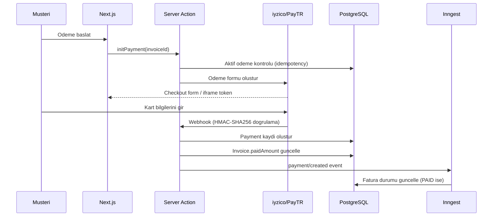
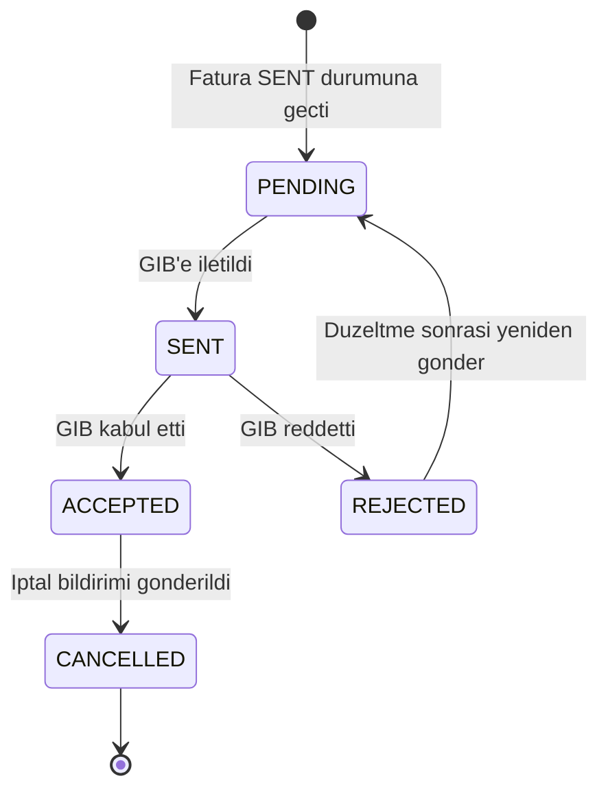
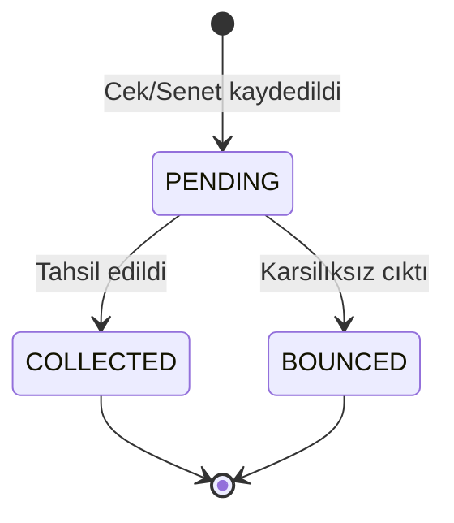

# Fatura, Odeme ve Muhasebe Entegrasyonu - Tasarım Belgesi

## Genel Bakış

Bu belge, MS Oto Servis SaaS platformunun **Fatura, Odeme ve Muhasebe Entegrasyonu** modülünün teknik tasarimini tanimlar. Mevcut `Invoice` ve `Payment` modelleri uzerine alti kritik özellik eklenerek Türkiye'ye özgü yasal yükümlülükler (e-Fatura/e-Arsiv, GIB uyumu), yerel odeme yontemleri (iyzico/PayTR, çek/senet), kalem bazli fatura detayi ve Paraşüt otomatik senkronizasyonu hayata gecirilecektir.

### Kapsam

| Özellik | Aciklama |
|---------|----------|
| InvoiceItem | Kalem bazli fatura detayi (iscilik, parca, hizmet) |
| PDF Üretimi | Sunucu tarafi PDF oluşturma ve S3 yukleme |
| Yerel Odeme | iyzico/PayTR online odeme + çek/senet takibi |
| e-Fatura/e-Arsiv | GIB uyumlu UBL-TR 2.1 entegrasyonu |
| Paraşüt Sync | Otomatik muhasebe senkronizasyonu (Inngest) |
| Numaralandirma | Tenant bazli siralı fatura numarasi ve muhasebe butunlugu |

### Tasarım Kararları

- **InvoiceItem modeli**: `ServiceItem` ile birebir eşleşen yapi; `ServiceOrder` -> `Invoice` dönüşümünde otomatik kopyalama.
- **PDF motoru**: Mevcut `lib/pdf-utils.ts` istemci taraflı yaklasim yerine sunucu tarafı `@react-pdf/renderer` veya Puppeteer kullanilir; S3'e yuklenir, `pdfUrl` guncellenir.
- **Odeme sağlayıcısı**: Tenant `settings.paymentProvider` alani ile `IYZICO` veya `PAYTR` secilir; webhook doğrulaması HMAC-SHA256 ile yapilir.
- **e-Fatura entegratörü**: Dogrudan GIB portali yerine ozel entegrator (ornegin Uyumsoft, Logo e-Fatura) API'si kullanilir; tenant `AccountingIntegration.settings` icerisinde entegrator kimlik bilgileri saklanir.
- **Paraşüt sync**: Mevcut `AccountingIntegration` modeli kullanilir; Inngest `parasut/sync-invoice` ve `parasut/sync-payment` event'leri ile arka planda calisir.
- **Fatura numaralandırma**: PostgreSQL `SELECT FOR UPDATE` ile kilit; `InvoiceSequence` yardimci tablosu ile yil bazli sira takibi.
- **Muhasebe butunlugu**: `subTotal + taxAmount - discountAmount = totalAmount` denkliğini Prisma middleware ile her kayit isleminde dogrula.

---

## Mimari

### Katmanlı Mimari

```
+------------------------------------------------------------------+
|                       Presentation Layer                         |
|  Next.js App Router Pages         |  Expo React Native Screens   |
|  /dashboard/finance/invoices/*    |  apps/mobile/app/(firma)/    |
|  /dashboard/finance/payments/*    |  fatura/[id].tsx             |
+-----------------------------------+------------------------------+
                                    |
+-----------------------------------v------------------------------+
|                       Application Layer                          |
|  Server Actions (lib/actions/)                                   |
|  invoice.actions.ts   |  payment.actions.ts                      |
|  e-invoice.actions.ts |  parasut.actions.ts                      |
+-----------------------------------+------------------------------+
                                    |
+-----------------------------------v------------------------------+
|                    Infrastructure Layer                          |
|  Prisma ORM (PostgreSQL)  |  Inngest (Background Jobs)           |
|  Upstash Redis (Cache)    |  AWS S3 (PDF/XML Storage)            |
|  Resend (Email)           |  Sentry (Error Monitoring)           |
|  iyzico/PayTR API         |  GIB e-Fatura Entegratoru            |
|  Paraşüt API              |                                      |
+------------------------------------------------------------------+
```

### Veri Akışı: Fatura Oluşturma ve PDF Üretimi

```mermaid
sequenceDiagram
    participant U as Kullanici
    participant SA as Server Action
    participant DB as PostgreSQL
    participant INN as Inngest
    participant S3 as AWS S3
    participant PAR as Paraşüt API

    U->>SA: Fatura olustur / durumu SENT yap
    SA->>DB: $transaction - Invoice + InvoiceItem kaydet
    SA->>DB: InvoiceSequence kilitle (SELECT FOR UPDATE)
    DB-->>SA: Siralı fatura numarasi
    SA->>INN: invoice/status-changed event
    INN->>S3: PDF olustur ve yukle
    S3-->>INN: pdfUrl
    INN->>DB: Invoice.pdfUrl guncelle
    INN->>PAR: Paraşüt senkronizasyonu (async)
    INN->>DB: ParaşütSyncLog kaydet
```

### Veri Akışı: Online Odeme (iyzico/PayTR)



### Veri Akışı: e-Fatura Gönderimi



### Veri Akışı: Cek/Senet Yasam Döngüsü



---

## Bileşenler ve Arayüzler

### 1. Server Actions

#### `lib/actions/invoice.actions.ts`

```typescript
// Fatura olustur (InvoiceItem'larla birlikte)
createInvoice(data: CreateInvoiceInput): Promise<ActionResult<{ invoiceId: string }>>

// Fatura guncelle (DRAFT durumunda)
updateInvoice(invoiceId: string, data: UpdateInvoiceInput): Promise<ActionResult>

// Fatura durumunu degistir (DRAFT -> SENT -> PAID | CANCELLED)
updateInvoiceStatus(invoiceId: string, status: InvoiceStatus): Promise<ActionResult>

// Is emrinden fatura olustur (ServiceItem -> InvoiceItem kopyalama)
createInvoiceFromServiceOrder(serviceOrderId: string): Promise<ActionResult<{ invoiceId: string }>>

// Fatura kalemi ekle
addInvoiceItem(invoiceId: string, data: CreateInvoiceItemInput): Promise<ActionResult<{ itemId: string }>>

// Fatura kalemi guncelle
updateInvoiceItem(itemId: string, data: UpdateInvoiceItemInput): Promise<ActionResult>

// Fatura kalemi sil (PAID faturada reddedilir)
deleteInvoiceItem(itemId: string): Promise<ActionResult>

// Fatura kalemi sirasini guncelle
reorderInvoiceItems(invoiceId: string, itemIds: string[]): Promise<ActionResult>

// Fatura listesi
getInvoices(filters?: InvoiceFilters): Promise<ActionResult<{ invoices: InvoiceWithItems[] }>>

// Fatura detayi
getInvoiceById(invoiceId: string): Promise<ActionResult<{ invoice: InvoiceDetail }>>

// PDF URL al (yoksa olustur)
getInvoicePdfUrl(invoiceId: string): Promise<ActionResult<{ url: string }>>
```

#### `lib/actions/payment.actions.ts`

```typescript
// Manuel odeme kaydi olustur (nakit, havale, cek, senet)
createPayment(data: CreatePaymentInput): Promise<ActionResult<{ paymentId: string }>>

// Online odeme baslat (iyzico/PayTR)
initOnlinePayment(invoiceId: string): Promise<ActionResult<{ checkoutToken: string; provider: string }>>

// Webhook isleme (iyzico/PayTR callback)
processPaymentWebhook(provider: string, payload: unknown, signature: string): Promise<ActionResult>

// Cek/senet durumunu guncelle (COLLECTED | BOUNCED)
updateCheckPaymentStatus(paymentId: string, status: CheckPaymentStatus): Promise<ActionResult>

// Odeme listesi
getPayments(filters?: PaymentFilters): Promise<ActionResult<{ payments: PaymentWithDetails[] }>>

// Vadesi yaklasan çek/senetleri getir
getUpcomingCheckPayments(daysAhead?: number): Promise<ActionResult<{ payments: CheckPayment[] }>>
```

#### `lib/actions/e-invoice.actions.ts`

```typescript
// e-Fatura gonder (GIB entegratörü araciligiyla)
sendEInvoice(invoiceId: string): Promise<ActionResult<{ uuid: string; ettn: string }>>

// e-Arsiv faturasi olustur ve e-posta ile gonder
sendEArchiveInvoice(invoiceId: string): Promise<ActionResult>

// Musteri e-Fatura mukellefiyetini sorgula
checkEInvoiceEligibility(taxNumber: string): Promise<ActionResult<{ isEligible: boolean }>>

// e-Fatura iptal bildirimi gonder
cancelEInvoice(invoiceId: string): Promise<ActionResult>

// e-Fatura durumunu GIB'den sorgula
queryEInvoiceStatus(invoiceId: string): Promise<ActionResult<{ status: EInvoiceStatus }>>
```

#### `lib/actions/parasut.actions.ts`

```typescript
// Manuel Paraşüt senkronizasyonu tetikle
syncInvoiceToParaşüt(invoiceId: string): Promise<ActionResult>

// Paraşüt baglantisini test et
testParaşütConnection(tenantId: string): Promise<ActionResult<{ connected: boolean }>>

// Senkronizasyon log listesi
getParaşütSyncLogs(invoiceId: string): Promise<ActionResult<{ logs: ParaşütSyncLog[] }>>
```

### 2. Inngest Background Jobs

#### `lib/inngest/functions/invoice-pdf-generator.ts`

```typescript
// Event: invoice/status-changed
// Tetikleyici: Fatura SENT veya PAID durumuna gectiginde
export const invoicePdfGeneratorFunction = inngest.createFunction(
  { id: "invoice-pdf-generator", name: "Fatura PDF Uretici" },
  { event: "invoice/status-changed" },
  async ({ event, step }) => {
    // 1. Invoice + InvoiceItem + Tenant + Customer verilerini cek
    // 2. @react-pdf/renderer ile PDF olustur
    // 3. S3'e invoices/{tenantId}/{invoiceNumber}.pdf olarak yukle (private)
    // 4. Invoice.pdfUrl guncelle
    // 5. Hata durumunda Sentry'e raporla
  }
);
```

**Timeout**: 30 saniye; asılırsa Sentry'e raporlanır.

#### `lib/inngest/functions/parasut-sync.ts`

```typescript
// Event: invoice/status-changed | payment/created | invoice/cancelled
export const parasutSyncFunction = inngest.createFunction(
  {
    id: "parasut-sync",
    name: "Paraşüt Senkronizasyonu",
    retries: 3,
    backoff: { type: "exponential", initialDelay: "30s" }
  },
  [
    { event: "invoice/status-changed" },
    { event: "payment/created" },
    { event: "invoice/cancelled" }
  ],
  async ({ event, step }) => {
    // 1. AccountingIntegration aktif mi kontrol et
    // 2. OAuth2 token al (Redis cache, 60s onceden yenile)
    // 3. Musteri vergi numarasiyla Paraşüt'ta ara / olustur
    // 4. Fatura / odeme / iptal islemini Paraşüt API'ye ilet
    // 5. ParaşütSyncLog kaydet (SUCCESS / FAILED)
    // 6. Tum denemeler basarisiz olursa Sentry + bildirim
  }
);
```

#### `lib/inngest/functions/check-payment-reminder.ts`

```typescript
// Event: scheduled (gunluk cron)
// Tetikleyici: Her gun sabah 09:00
export const checkPaymentReminderFunction = inngest.createFunction(
  { id: "check-payment-reminder", name: "Cek/Senet Vade Hatirlatici" },
  { cron: "0 9 * * *" },
  async ({ step }) => {
    // 1. Vadesi 3 gun veya daha az kalan PENDING çek/senetleri bul
    // 2. Her tenant icin TENANT_ADMIN rolundeki kullanicilara bildirim olustur
    // 3. Bildirim kanalina gore (in-app / email) ilet
  }
);
```

#### `lib/inngest/functions/e-invoice-status-poller.ts`

```typescript
// Event: scheduled (saatlik cron)
// Tetikleyici: Her saat basi
export const eInvoiceStatusPollerFunction = inngest.createFunction(
  { id: "e-invoice-status-poller", name: "e-Fatura Durum Sorgulayici" },
  { cron: "0 * * * *" },
  async ({ step }) => {
    // 1. eInvoiceStatus = SENT olan faturalari bul
    // 2. GIB entegratörü API'sinden durum sorgula
    // 3. ACCEPTED / REJECTED durumuna guncelle
    // 4. REJECTED ise hata mesajini kaydet ve bildirim gonder
  }
);
```

### 3. API Route Handlerları

#### `app/api/webhooks/iyzico/route.ts`

```typescript
// POST /api/webhooks/iyzico
// iyzico'dan gelen odeme bildirimleri
export async function POST(request: Request) {
  // 1. HMAC-SHA256 imza dogrulama
  // 2. Odeme durumuna gore Payment kaydi olustur / guncelle
  // 3. Invoice.paidAmount guncelle
  // 4. Inngest event tetikle
}
```

#### `app/api/webhooks/paytr/route.ts`

```typescript
// POST /api/webhooks/paytr
// PayTR'den gelen odeme bildirimleri
export async function POST(request: Request) {
  // 1. PayTR hash dogrulama (MD5)
  // 2. Odeme durumuna gore isleme al
}
```

#### `app/api/invoices/[id]/pdf/route.ts`

```typescript
// GET /api/invoices/[id]/pdf
// Fatura PDF'ini indir (S3 presigned URL)
export async function GET(request: Request, { params }: { params: { id: string } }) {
  // 1. Yetki kontrolu (tenantId izolasyonu)
  // 2. pdfUrl varsa S3 presigned URL olustur
  // 3. Yoksa PDF oluşturma job'ini tetikle ve bekleme mesaji don
}
```

### 4. Sayfa Yapısı (Next.js App Router)

```
app/(dashboard)/dashboard/finance/
+-- invoices/
|   +-- page.tsx                    # Fatura listesi
|   +-- new/page.tsx                # Yeni fatura olustur
|   +-- [id]/page.tsx               # Fatura detayi
|   +-- [id]/edit/page.tsx          # Fatura duzenle (DRAFT)
+-- payments/
|   +-- page.tsx                    # Odeme listesi
|   +-- new/page.tsx                # Manuel odeme kaydi
|   +-- checks/page.tsx             # Cek/senet takibi
+-- accounting/
    +-- page.tsx                    # Muhasebe entegrasyon ayarlari
    +-- parasut/page.tsx            # Paraşüt baglanti ve log
    +-- e-invoice/page.tsx          # e-Fatura ayarlari ve durum
```

---

## Veri Modelleri

### Yeni Prisma Modelleri

#### `InvoiceItem` - Fatura Kalemi

```prisma
enum InvoiceItemType {
  LABOR    // Iscilik
  PART     // Yedek Parca
  SERVICE  // Hizmet
}

model InvoiceItem {
  id           String          @id @default(uuid())
  tenantId     String
  tenant       Tenant          @relation(fields: [tenantId], references: [id], onDelete: Cascade)

  invoiceId    String
  invoice      Invoice         @relation(fields: [invoiceId], references: [id], onDelete: Cascade)

  type         InvoiceItemType @default(SERVICE)
  name         String          @db.VarChar(255)
  description  String?         @db.Text

  quantity     Decimal         @db.Decimal(10, 2)
  unitPrice    Decimal         @db.Decimal(15, 2)  // KDV haric birim fiyat
  taxRate      Decimal         @default(20) @db.Decimal(5, 2)
  discountRate Decimal         @default(0) @db.Decimal(5, 2)  // Yuzde indirim
  lineTotal    Decimal         @db.Decimal(15, 2)  // Hesaplanan satir toplami (KDV dahil)

  sortOrder    Int             @default(0)

  // Kaynak referanslari (opsiyonel)
  serviceItemId String?        @db.VarChar(255)  // Kopyalandigi ServiceItem ID

  createdAt    DateTime        @default(now())
  updatedAt    DateTime        @updatedAt

  @@index([tenantId])
  @@index([invoiceId])
  @@index([type])
}
```

**lineTotal hesaplama formulu**:
`lineTotal = (quantity * unitPrice * (1 - discountRate/100)) * (1 + taxRate/100)`

#### `CheckPayment` - Cek/Senet Detayi

```prisma
enum CheckPaymentStatus {
  PENDING     // Beklemede
  COLLECTED   // Tahsil edildi
  BOUNCED     // Karsilıksız
}

model CheckPayment {
  id           String             @id @default(uuid())
  tenantId     String
  tenant       Tenant             @relation(fields: [tenantId], references: [id], onDelete: Cascade)

  paymentId    String             @unique
  payment      Payment            @relation(fields: [paymentId], references: [id], onDelete: Cascade)

  checkNumber  String             @db.VarChar(100)
  bankName     String             @db.VarChar(255)
  dueDate      DateTime           @db.Date
  drawerName   String             @db.VarChar(255)  // Keseyen kisi/firma
  status       CheckPaymentStatus @default(PENDING)

  collectedAt  DateTime?
  bouncedAt    DateTime?
  notes        String?            @db.Text

  createdAt    DateTime           @default(now())
  updatedAt    DateTime           @updatedAt

  @@index([tenantId])
  @@index([dueDate])
  @@index([status])
}
```

#### `PaymentAttempt` - Basarisiz Odeme Girisimi

```prisma
model PaymentAttempt {
  id            String   @id @default(uuid())
  tenantId      String
  tenant        Tenant   @relation(fields: [tenantId], references: [id], onDelete: Cascade)

  invoiceId     String
  invoice       Invoice  @relation(fields: [invoiceId], references: [id], onDelete: Cascade)

  provider      String   @db.VarChar(50)   // "IYZICO" | "PAYTR"
  amount        Decimal  @db.Decimal(15, 2)
  errorCode     String?  @db.VarChar(100)
  errorMessage  String?  @db.Text
  rawResponse   Json?    @default("{}")

  attemptedAt   DateTime @default(now())

  @@index([tenantId])
  @@index([invoiceId])
  @@index([attemptedAt])
}
```

#### `ParaşütSyncLog` - Paraşüt Senkronizasyon Logu

```prisma
enum ParaşütSyncStatus {
  SUCCESS
  FAILED
}

model ParaşütSyncLog {
  id           String            @id @default(uuid())
  tenantId     String
  tenant       Tenant            @relation(fields: [tenantId], references: [id], onDelete: Cascade)

  invoiceId    String?
  invoice      Invoice?          @relation(fields: [invoiceId], references: [id], onDelete: SetNull)

  paymentId    String?
  payment      Payment?          @relation(fields: [paymentId], references: [id], onDelete: SetNull)

  operation    String            @db.VarChar(50)  // "CREATE_INVOICE" | "UPDATE_INVOICE" | "CREATE_PAYMENT" | "CANCEL_INVOICE"
  status       ParaşütSyncStatus
  errorMessage String?           @db.Text
  attemptedAt  DateTime          @default(now())

  @@index([tenantId])
  @@index([invoiceId])
  @@index([status])
  @@index([attemptedAt])
}
```

#### `InvoiceSequence` - Fatura Numaralandirma Yardimci Tablosu

```prisma
model InvoiceSequence {
  id        String @id @default(uuid())
  tenantId  String
  year      Int
  lastSeq   Int    @default(0)

  @@unique([tenantId, year])
  @@index([tenantId])
}
```

### Mevcut Model Güncellemeleri

#### `Invoice` Genisletmesi

Mevcut `Invoice` modeline asagidaki alanlar eklenir:

```prisma
model Invoice {
  // ... mevcut alanlar korunur ...

  // Yeni alanlar:
  items              InvoiceItem[]
  paymentAttempts    PaymentAttempt[]
  parasutSyncLogs    ParaşütSyncLog[]

  // e-Fatura alanlari:
  eInvoiceStatus     EInvoiceStatus?   // PENDING | SENT | ACCEPTED | REJECTED | CANCELLED
  eInvoiceUUID       String?           @db.VarChar(100)
  eInvoiceETTN       String?           @db.VarChar(100)
  eInvoiceXmlUrl     String?           @db.Text  // S3 URL
  eInvoiceErrorMessage String?         @db.Text
  eInvoiceType       EInvoiceDocType?  // E_INVOICE | E_ARCHIVE
  eInvoiceSentAt     DateTime?
}

enum EInvoiceStatus {
  PENDING
  SENT
  ACCEPTED
  REJECTED
  CANCELLED
}

enum EInvoiceDocType {
  E_INVOICE   // e-Fatura (mukellef musteri)
  E_ARCHIVE   // e-Arsiv (mukellef olmayan musteri)
}
```

#### `Payment` Genisletmesi

```prisma
enum PaymentMethod {
  CASH
  CREDIT_CARD
  BANK_TRANSFER
  IYZICO          // YENİ
  PAYTR           // YENİ
  CHECK           // YENİ - Cek
  PROMISSORY_NOTE // YENİ - Senet
}

model Payment {
  // ... mevcut alanlar korunur ...

  // Yeni alanlar:
  checkPayment    CheckPayment?
  parasutSyncLogs ParaşütSyncLog[]

  // Online odeme referansi:
  providerPaymentId String?  @db.VarChar(255)  // iyzico/PayTR odeme ID
}
```

#### `Tenant` Genisletmesi

```prisma
model Tenant {
  // ... mevcut alanlar korunur ...

  // Yeni iliskiler:
  invoiceItems     InvoiceItem[]
  checkPayments    CheckPayment[]
  paymentAttempts  PaymentAttempt[]
  parasutSyncLogs  ParaşütSyncLog[]
  invoiceSequences InvoiceSequence[]
}
```

### Zod Validasyon Şemaları

#### `lib/validations/invoice.ts`

```typescript
export const invoiceItemSchema = z.object({
  type: z.enum(["LABOR", "PART", "SERVICE"]),
  name: z.string().min(1).max(255),
  description: z.string().max(1000).optional(),
  quantity: z.number().positive(),
  unitPrice: z.number().min(0),
  taxRate: z.number().min(0).max(100).default(20),
  discountRate: z.number().min(0).max(100).default(0),
  sortOrder: z.number().int().min(0).default(0),
});

export const createInvoiceSchema = z.object({
  customerId: z.string().uuid().optional(),
  serviceOrderId: z.string().uuid().optional(),
  dueDate: z.date().optional(),
  notes: z.string().max(2000).optional(),
  items: z.array(invoiceItemSchema).default([]),
});

export const updateInvoiceStatusSchema = z.object({
  status: z.enum(["SENT", "PAID", "CANCELLED"]),
});
```

#### `lib/validations/payment.ts`

```typescript
export const createPaymentSchema = z.object({
  invoiceId: z.string().uuid().optional(),
  customerId: z.string().uuid().optional(),
  amount: z.number().positive(),
  paymentMethod: z.enum([
    "CASH", "CREDIT_CARD", "BANK_TRANSFER",
    "IYZICO", "PAYTR", "CHECK", "PROMISSORY_NOTE"
  ]),
  paymentDate: z.date().default(() => new Date()),
  notes: z.string().max(1000).optional(),
  // Cek/senet icin ek alanlar:
  checkDetails: z.object({
    checkNumber: z.string().min(1).max(100),
    bankName: z.string().min(1).max(255),
    dueDate: z.date(),
    drawerName: z.string().min(1).max(255),
  }).optional(),
}).refine(
  (data) => {
    if (["CHECK", "PROMISSORY_NOTE"].includes(data.paymentMethod)) {
      return !!data.checkDetails;
    }
    return true;
  },
  { message: "Cek/senet icin detay bilgileri zorunludur" }
);
```

---

## Doğru Özellikler (Correctness Properties)

*Bir özellik (property), bir sistemin tum gecerli calismalari boyunca dogru olmasi gereken bir karakteristik veya davranistir; esasen sistemin ne yapmasi gerektigi hakkinda resmi bir ifadedir. Özellikler, insan tarafindan okunabilir spesifikasyonlar ile makine tarafindan dogrulanabilir dogruluk garantileri arasinda kopru gorevi gorur.*

### Özellik 1: InvoiceItem lineTotal Hesaplama Dogru Olmalı

*Her* gecerli `quantity` (> 0), `unitPrice` (>= 0), `discountRate` (0-100) ve `taxRate` (0-100) kombinasyonu icin, hesaplanan `lineTotal` degeri `(quantity * unitPrice * (1 - discountRate/100)) * (1 + taxRate/100)` formulune esit olmalidir.

**Dogrular: Gereksinim 1.2**

### Özellik 2: Fatura Toplam Tutarlari Kalem Toplamlarindan Turetilmeli

*Her* `InvoiceItem` listesi icin, `Invoice.subTotal` = sum(quantity * unitPrice * (1 - discountRate/100)), `Invoice.taxAmount` = sum(lineTotal - subTotal_satir), ve `Invoice.totalAmount` = subTotal + taxAmount - discountAmount denkliğinin saglanmasi gerekir.

**Dogrular: Gereksinim 1.3, 6.5**

### Özellik 3: Is Emrinden Fatura Donusumu Veri Butunlugunu Korumalı

*Her* `ServiceItem` listesi icin, `createInvoiceFromServiceOrder` donusumu sonrasi her `InvoiceItem`'in kaynak `ServiceItem` ile `name`, `quantity`, `unitPrice` ve `taxRate` alanlarinda eslestigini dogrulamak gerekir.

**Dogrular: Gereksinim 1.4**

### Özellik 4: PAID Faturada Kalem Silme Reddedilmeli

*Her* fatura durumu icin, fatura `PAID` durumundayken `InvoiceItem` silme girisimi reddedilmeli; `DRAFT` veya `SENT` durumundayken izin verilmelidir.

**Dogrular: Gereksinim 1.6**

### Özellik 5: Tarih ve Para Birimi Formatlama Tutarli Olmali

*Her* gecerli `DateTime` degeri icin format fonksiyonu `DD.MM.YYYY` ciktisi uretmeli; *her* gecerli `Decimal` para degeri icin format fonksiyonu `TL#.###,##` sablonuna uygun cikti uretmelidir.

**Dogrular: Gereksinim 2.7**

### Özellik 6: PDF Icerik Zorunlu Alanlari Icermeli

*Her* gecerli `Invoice` + `InvoiceItem` listesi + `Tenant` + `Customer` kombinasyonu icin, PDF render fonksiyonunun ciktisi firma adi, vergi numarasi, fatura numarasi, musteri adi, kalem listesi, ara toplam, KDV tutari ve genel toplam bilgilerini icermelidir.

**Dogrular: Gereksinim 2.2**

### Özellik 7: Odeme Sonrasi Fatura Durumu Dogru Guncellenmeli

*Her* `Invoice.totalAmount` ve `Payment.amount` kombinasyonu icin, odeme sonrasi `Invoice.paidAmount` = onceki paidAmount + yeni odeme tutari olmali; `paidAmount >= totalAmount` ise fatura durumu `PAID` olmali, aksi halde `SENT` kalmalidir.

**Dogrular: Gereksinim 3.3, 6.6**

### Özellik 8: Webhook Imza Dogrulamasi Tutarli Olmali

*Her* rastgele payload icin, dogru HMAC-SHA256 imzasiyla imzalanmis istek kabul edilmeli; yanlis veya eksik imzayla gelen istek reddedilmelidir.

**Dogrular: Gereksinim 3.9**

### Özellik 9: Cek/Senet Vade Bildirim Esigi Dogru Hesaplenmeli

*Her* `CheckPayment.dueDate` degeri icin, bugunun tarihine gore kalan gun sayisi 3 veya daha az ise bildirim tetiklenmeli; 4 veya daha fazla ise tetiklenmemelidir.

**Dogrular: Gereksinim 3.6**

### Özellik 10: Fatura Numarasi Formati Tutarli Olmali

*Her* tenant ve yil kombinasyonu icin, uretilen fatura numarasi `{YIL}-{SIRA:04d}` formatina uygun olmali (ornegin `2025-0001`); ayni tenant ve yil icin uretilen tum numaralar benzersiz olmalidir.

**Dogrular: Gereksinim 6.1, 6.2**

### Özellik 11: Iptal Edilen Fatura Numarasi Yeniden Kullanilmamali

*Her* iptal edilen fatura icin, sonraki fatura numarasinin iptal edilenin numarasini almadigi dogrulanmalidir; sira numarasi bir sonraki degerden devam etmelidir.

**Dogrular: Gereksinim 6.4**

### Özellik 12: PAID/CANCELLED Faturada Tutar Degisikligi Reddedilmeli

*Her* fatura durumu icin, fatura `PAID` veya `CANCELLED` durumundayken `subTotal`, `taxAmount` veya `totalAmount` degistirme girisimi reddedilmeli; `DRAFT` veya `SENT` durumundayken izin verilmelidir.

**Dogrular: Gereksinim 6.8**

### Özellik 13: Paraşüt Retry Sayisi Asılmamalı

*Her* Paraşüt API hata senaryosu icin, Inngest retry mekanizmasi en fazla 3 deneme yapmali; her deneme arasindaki bekleme suresi bir oncekinin en az 2 kati olmalidir (exponential backoff).

**Dogrular: Gereksinim 5.4**

### Özellik 14: Paraşüt Kalem Eslestirmesi Bire Bir Olmali

*Her* `InvoiceItem` listesi icin, Paraşüt API'ye gonderilen fatura satirlarinin sayisi ve icerigi (ad, miktar, birim fiyat, KDV orani) `InvoiceItem` listesiyle birebir eslesmelidir.

**Dogrular: Gereksinim 5.8**

---

## Hata Yönetimi

### Fatura Islemi Hatalari

| Hata Durumu | Davranis | HTTP Kodu |
|-------------|----------|-----------|
| PAID faturada kalem silme | `"PAID_INVOICE_IMMUTABLE"` hatasi don | 422 |
| PAID/CANCELLED faturada tutar degisikligi | `"INVOICE_LOCKED"` hatasi don | 422 |
| Muhasebe denklik hatasi | `"ACCOUNTING_INTEGRITY_ERROR"` hatasi don | 422 |
| Fatura numarasi cakismasi | Transaction rollback + yeniden dene (max 3) | 409 |
| PDF oluşturma timeout (30s) | Sentry raporla + `"PDF_GENERATION_TIMEOUT"` hatasi | 504 |

### Odeme Islemi Hatalari

| Hata Durumu | Davranis |
|-------------|----------|
| Webhook imza dogrulama hatasi | 401 don + Sentry raporla |
| Ayni fatura icin esz zamanli odeme | `"PAYMENT_IN_PROGRESS"` hatasi + 409 |
| iyzico/PayTR API hatasi | `PaymentAttempt` kaydi olustur + kullaniciya hata mesaji |
| Karsilıksız cek | `CheckPayment.status = BOUNCED` + musteri bakiyesi geri yukle + bildirim |

### e-Fatura Hatalari

| Hata Durumu | Davranis |
|-------------|----------|
| GIB entegratörü erisim hatasi | `eInvoiceStatus = FAILED` + Sentry + bildirim |
| GIB red yaniti | `eInvoiceStatus = REJECTED` + `eInvoiceErrorMessage` kaydet + bildirim |
| Vergi numarasi sorgulama hatasi | Varsayilan olarak e-Arsiv kullan + uyari logu |
| XML uretim hatasi | Sentry raporla + `eInvoiceStatus = FAILED` |

### Paraşüt Senkronizasyon Hatalari

| Hata Durumu | Davranis |
|-------------|----------|
| API erisim hatasi | Exponential backoff ile 3 kez yeniden dene |
| OAuth2 token yenileme hatasi | Sentry raporla + senkronizasyonu atla |
| Tum denemeler basarisiz | `ParaşütSyncLog.status = FAILED` + Sentry + bildirim |
| AccountingIntegration aktif degil | Sessizce atla, hata uretme |

### Genel Hata Prensipleri

- Tum kritik hatalar Sentry'e raporlanir (`captureException` ile).
- Kullaniciya gosterilen hata mesajlari Turkce ve aciklayici olmalidir.
- Hassas bilgiler (API anahtarlari, kart numaralari) hicbir zaman loglara yazilmaz.
- Webhook endpoint'leri her zaman 200 doner (basarisiz isleme bile); tekrar deneme dongusunu onlemek icin.

---

## Test Stratejisi

### Birim Testleri (Jest + ts-jest)

Asagidaki saf fonksiyonlar icin birim testleri yazilir:

- `calculateLineTotal(quantity, unitPrice, discountRate, taxRate)` — formul dogrulugu
- `calculateInvoiceTotals(items)` — toplam hesaplama
- `formatTurkishDate(date)` — DD.MM.YYYY formati
- `formatTurkishCurrency(amount)` — TL#.###,## formati
- `generateInvoiceNumber(year, seq)` — numara formati
- `verifyWebhookSignature(payload, signature, secret)` — HMAC dogrulama
- `isCheckPaymentDueSoon(dueDate, daysThreshold)` — vade kontrolu
- `mapInvoiceItemsToParaşütLines(items)` — kalem eslestirme

### Özellik Bazli Testler (fast-check)

Her özellik icin en az 100 iterasyon calistirilir. Test etiketi formati:
`// Feature: invoice-payment-accounting, Property {N}: {property_text}`

```typescript
// Ornek: Özellik 1 - lineTotal hesaplama
import * as fc from "fast-check";
import { calculateLineTotal } from "@/lib/invoice-utils";

test("Property 1: lineTotal formule uygun hesaplanmali", () => {
  fc.assert(
    fc.property(
      fc.float({ min: 0.01, max: 10000 }),  // quantity
      fc.float({ min: 0, max: 100000 }),     // unitPrice
      fc.float({ min: 0, max: 100 }),        // discountRate
      fc.float({ min: 0, max: 100 }),        // taxRate
      (quantity, unitPrice, discountRate, taxRate) => {
        const result = calculateLineTotal(quantity, unitPrice, discountRate, taxRate);
        const expected = (quantity * unitPrice * (1 - discountRate / 100)) * (1 + taxRate / 100);
        return Math.abs(result - expected) < 0.01; // Ondalik hassasiyet
      }
    ),
    { numRuns: 100 }
  );
});
```

### Entegrasyon Testleri

Mock'larla test edilecek entegrasyon noktalari:

| Entegrasyon | Mock Stratejisi | Test Sayisi |
|-------------|-----------------|-------------|
| AWS S3 PDF yukleme | `jest.mock("@aws-sdk/client-s3")` | 3 |
| iyzico/PayTR webhook | Mock HTTP request + imza | 4 |
| GIB e-Fatura API | Mock entegrator API yaniti | 5 |
| Paraşüt API | Mock OAuth2 + CRUD endpoint'leri | 6 |
| Inngest event tetikleme | `jest.mock("@/lib/inngest/client")` | 4 |
| Resend e-posta | `jest.mock("resend")` | 2 |

### Duman Testleri (Smoke Tests)

- `AccountingIntegration` kaydi olusturulabilir ve aktif edilebilir
- Inngest job'lari kayitli ve tetiklenebilir durumda
- S3 bucket erisimi ve yazma izni mevcut
- Paraşüt OAuth2 token alinabilir (canli ortamda)

### Test Dosya Yapısı

```
apps/web/__tests__/
+-- invoice/
|   +-- invoice-utils.test.ts       # Saf fonksiyon birim testleri
|   +-- invoice-utils.property.test.ts  # fast-check özellik testleri
|   +-- invoice.actions.test.ts     # Server action entegrasyon testleri
+-- payment/
|   +-- payment-utils.test.ts
|   +-- webhook.test.ts             # Webhook imza dogrulama testleri
+-- parasut/
|   +-- parasut-sync.test.ts        # Paraşüt senkronizasyon testleri
+-- e-invoice/
|   +-- e-invoice.test.ts           # e-Fatura uretim testleri
```

