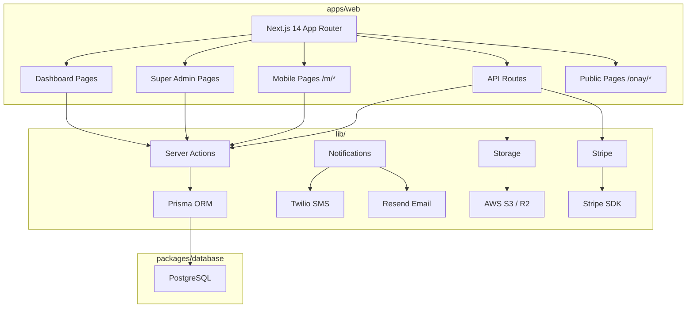

# Tasarım Belgesi - Eksik Özellikler Yol Haritası

## Genel Bakış

Bu belge, MS Oto Servis SaaS platformunun eksik özelliklerinin teknik tasarımını kapsar.
Proje Next.js 14 App Router, PostgreSQL, Prisma ORM ve Turborepo monorepo mimarisi üzerine kurulmuştur.
Tasarım, mevcut kod tabanının kalıplarıyla (server actions, Zod validasyonları, Material Design 3) tam uyumlu olacak şekilde hazırlanmıştır.

### Kapsam

1. Fatura Detay Sayfası
2. Teklif/Keşif Sistemi
3. Müşteri Onay Akışı
4. Mobil Müşteri Randevu Sayfası
5. Mobil Firma Personel Sayfası
6. SMS/E-posta Bildirim Altyapısı
7. Dosya Yükleme Altyapısı
8. Usta Performans Raporu
9. Stripe Ödeme Entegrasyonu
10. Super Admin Eksik Sayfalar
11. Veritabanı Şeması Eksikleri

---

## Mimari

### Genel Mimari Diyagramı



### Mevcut Kalıplarla Uyum

- **Server Actions**: `"use server"` direktifi, `auth()` ile oturum doğrulama, `tenantId` izolasyonu, `revalidatePath` ile cache yenileme
- **Validasyon**: Zod şemaları `lib/validations/` altında, `schema.parse(data)` kullanımı
- **UI**: Material Design 3 renk token'ları, Tailwind CSS, `material-symbols-outlined` ikonlar
- **Veri Serializasyonu**: Prisma `Decimal` → `Number()` dönüşümü, JSON.parse/stringify ile client'a aktarım

---

## Bileşenler ve Arayüzler

### 1. Fatura Detay Sayfası

**Dosya Yapısı:**
```
apps/web/app/(dashboard)/dashboard/finances/invoices/[id]/
├── page.tsx                 # Server Component - veri çekme
└── InvoiceDetailClient.tsx  # Client Component - UI
```

`page.tsx`: `getInvoiceById(id)` çağırır (zaten `finance.actions.ts`'de mevcut). Fatura bulunamazsa `/dashboard/finances`'a yönlendirir.

`InvoiceDetailClient.tsx` bölümleri:
- Fatura başlığı: numara, durum badge, tarih
- Müşteri bilgi kartı
- Servis emri linki (varsa)
- Ödeme geçmişi listesi
- Ödeme kaydetme formu (inline)
- PDF yazdırma butonu (`window.print()`)

**`finance.actions.ts` Eklenecek Fonksiyon:**
```typescript
export async function addPaymentToInvoice(data: {
  invoiceId: string;
  amount: number;
  paymentMethod: "CASH" | "CREDIT_CARD" | "BANK_TRANSFER";
  paymentDate: string;
  notes?: string;
}): Promise<{ success?: string; error?: string }>
```

---

### 2. Teklif/Keşif Sistemi

**Dosya Yapısı:**
```
apps/web/app/(dashboard)/dashboard/quotes/
├── page.tsx
└── [id]/page.tsx

apps/web/components/dashboard/quotes/
├── QuoteBoardClient.tsx
├── QuoteFormModal.tsx
└── QuoteDetailClient.tsx

apps/web/lib/actions/quote.actions.ts
apps/web/lib/validations/quotes.ts
```

**`quote.actions.ts` Fonksiyon İmzaları:**
```typescript
export async function getQuotes(): Promise<{ quotes?: SerializedQuote[]; error?: string }>
export async function getQuoteById(id: string): Promise<{ quote?: SerializedQuote; error?: string }>
export async function createQuote(data: CreateQuoteInput): Promise<{ success?: string; quoteId?: string; error?: string }>
export async function addQuoteItem(data: AddQuoteItemInput): Promise<{ success?: string; error?: string }>
export async function updateQuoteStatus(data: UpdateQuoteStatusInput): Promise<{ success?: string; error?: string }>
export async function convertQuoteToServiceOrder(quoteId: string): Promise<{ success?: string; serviceOrderId?: string; error?: string }>
```

**Sidebar Güncellemesi (`Sidebar.tsx`):**
```typescript
// menuItems dizisine Servis Emirleri'nden sonra eklenir:
{ name: "Teklifler", href: "/dashboard/quotes", icon: "request_quote" }
```

---

### 3. Müşteri Onay Akışı

**Dosya Yapısı:**
```
apps/web/app/api/approval/[token]/route.ts   # GET: doğrulama, POST: onay/red
apps/web/app/onay/[token]/page.tsx           # Public müşteri onay sayfası
apps/web/lib/actions/approval.actions.ts
```

**`approval.actions.ts` Fonksiyon İmzaları:**
```typescript
export async function generateApprovalToken(serviceOrderId: string): Promise<{ token?: string; error?: string }>
export async function validateApprovalToken(token: string): Promise<{ serviceOrder?: ApprovalOrderData; error?: string }>
export async function approveServiceOrder(token: string): Promise<{ success?: string; error?: string }>
export async function rejectServiceOrder(token: string, reason: string): Promise<{ success?: string; error?: string }>
```

**Token Üretimi:**
```typescript
import { randomBytes } from "crypto";
const token = randomBytes(32).toString("hex"); // 64 karakter hex
const expiry = new Date(Date.now() + 48 * 60 * 60 * 1000); // 48 saat
```

**`ServiceOrder` Şema Değişiklikleri:**
```prisma
model ServiceOrder {
  // ... mevcut alanlar ...
  approvalToken       String?   @unique @db.VarChar(255)
  approvalTokenExpiry DateTime?
}
```

**`route.ts` Yapısı:**
```typescript
// GET /api/approval/[token] - Token doğrulama
export async function GET(req: Request, { params }: { params: { token: string } })

// POST /api/approval/[token]
// Body: { action: "APPROVE" | "REJECT", reason?: string }
export async function POST(req: Request, { params }: { params: { token: string } })
```

---

### 4. Mobil Müşteri Randevu Sayfası

**Dosya Yapısı:**
```
apps/web/app/m/musteri/randevu/page.tsx
```

Mevcut `appointment.actions.ts` kullanılır (`createAppointment`, `getAppointments`).
Müşteri kimliği mobil session cookie'den alınır (mevcut `musteri-giris` akışı).

**Sayfa Bölümleri:**
- Üst: Geçmiş ve gelecek randevular listesi
- Alt: Yeni randevu formu (araç seçimi, tarih, saat, servis türü)

**Navigasyon Güncellemeleri:**
```tsx
// panel/page.tsx - Servis Randevusu butonu:
<Link href="/m/musteri/randevu">...</Link>

// gecmis/page.tsx - Randevu Talebi butonu:
<Link href="/m/musteri/randevu">...</Link>
```

---

### 5. Mobil Firma Personel Sayfası

**Dosya Yapısı:**
```
apps/web/app/m/firma/personel/page.tsx
```

**Veri Kaynağı:**
- `prisma.mechanic.findMany()` — usta listesi
- `prisma.serviceOrder.count()` — her usta için aktif iş emri sayısı
- `stitch_sablon2/firma_mobil_personel_kadrosu.html` tasarımı referans alınır

**Sayfa Bölümleri:**
- Özet kartlar: Toplam aktif usta, açık iş emri, ortalama doluluk
- Durum filtresi: Müsait / Meşgul / İzinli
- Usta kartları: İsim, uzmanlık, aktif iş sayısı, durum badge

---

### 6. SMS/E-posta Bildirim Altyapısı

**Dosya Yapısı:**
```
apps/web/lib/notifications/
├── sms.ts       # Twilio entegrasyonu
├── email.ts     # Resend entegrasyonu
└── templates.ts # Bildirim şablonları
```

**`sms.ts` Arayüzü:**
```typescript
interface SendSmsOptions {
  to: string;       // +90...
  body: string;
  tenantId: string;
}
export async function sendSms(options: SendSmsOptions): Promise<{ success: boolean; error?: string }>
```

**`email.ts` Arayüzü:**
```typescript
interface SendEmailOptions {
  to: string;
  subject: string;
  html: string;
  tenantId: string;
}
export async function sendEmail(options: SendEmailOptions): Promise<{ success: boolean; error?: string }>
```

**`templates.ts` Şablonları:**
```typescript
export function getServiceStatusTemplate(params: { customerName: string; status: string; orderNumber: number; vehiclePlate: string }): { sms: string; emailHtml: string }
export function getApprovalRequestTemplate(params: { customerName: string; approvalUrl: string; totalAmount: number; vehiclePlate: string }): { sms: string; emailHtml: string }
export function getAppointmentConfirmTemplate(params: { customerName: string; date: string; time: string }): { sms: string; emailHtml: string }
export function getQuoteSentTemplate(params: { customerName: string; quoteUrl: string; totalAmount: number }): { sms: string; emailHtml: string }
```

**Ortam Değişkenleri:**
```
TWILIO_ACCOUNT_SID=
TWILIO_AUTH_TOKEN=
TWILIO_PHONE_NUMBER=
RESEND_API_KEY=
```

---

### 7. Dosya Yükleme Altyapısı

**Dosya Yapısı:**
```
apps/web/app/api/upload/route.ts
apps/web/lib/storage.ts
```

**`storage.ts` Arayüzü:**
```typescript
export async function uploadFile(file: Buffer, key: string, contentType: string): Promise<{ url: string; key: string }>
export async function deleteFile(key: string): Promise<void>
export function getPublicUrl(key: string): string
```

**`route.ts`:**
```typescript
// POST /api/upload
// FormData: file, serviceOrderId?, vehicleId?
// Yanıt: { documentId: string; fileUrl: string }
export async function POST(req: Request)
```

**Ortam Değişkenleri:**
```
AWS_ACCESS_KEY_ID=
AWS_SECRET_ACCESS_KEY=
AWS_REGION=
AWS_S3_BUCKET=
```

---

### 8. Usta Performans Raporu

**Dosya Yapısı:**
```
apps/web/components/dashboard/mechanics/PerformanceReport.tsx
```

**`mechanic.actions.ts` Eklenecek Fonksiyonlar:**
```typescript
export async function getMechanicPerformance(mechanicId: string, period: "current" | "previous"): Promise<PerformanceData>
export async function getCommissionRules(mechanicId?: string): Promise<CommissionRule[]>
export async function createCommissionRule(data: CreateCommissionRuleInput): Promise<{ success?: string; error?: string }>
export async function calculateCommission(mechanicId: string, month: Date): Promise<{ amount: number; breakdown: CommissionBreakdown[] }>
```

---

### 9. Stripe Ödeme Entegrasyonu

**Dosya Yapısı:**
```
apps/web/app/api/stripe/webhook/route.ts
apps/web/app/api/stripe/checkout/route.ts
apps/web/lib/stripe.ts
```

**`stripe.ts`:**
```typescript
import Stripe from "stripe";
export const stripe = new Stripe(process.env.STRIPE_SECRET_KEY!, { apiVersion: "2026-06-20" });
```

**`checkout/route.ts`:**
```typescript
// POST /api/stripe/checkout
// Body: { planId: string, billingCycle: "monthly" | "yearly" }
// Yanıt: { url: string }
export async function POST(req: Request)
```

**`webhook/route.ts` İşlenen Olaylar:**
- `checkout.session.completed` → Subscription ACTIVE
- `invoice.payment_succeeded` → Dönem güncelleme
- `invoice.payment_failed` → Subscription PAST_DUE
- `customer.subscription.deleted` → Subscription CANCELLED

**Ortam Değişkenleri:**
```
STRIPE_SECRET_KEY=
STRIPE_PUBLISHABLE_KEY=
STRIPE_WEBHOOK_SECRET=
```

---

### 10. Super Admin Eksik Sayfalar

**Dosya Yapısı:**
```
apps/web/app/(super-admin)/super-admin/
├── command-center/page.tsx
├── strategic-insights/page.tsx
├── tenant-performance/page.tsx
└── payment-operations/page.tsx
```

**`superadmin.actions.ts` Eklenecek Fonksiyonlar:**
```typescript
export async function getCommandCenterData(): Promise<CommandCenterData>
export async function getStrategicInsights(): Promise<StrategicInsightsData>
export async function getTenantPerformanceMatrix(): Promise<TenantPerformanceRow[]>
export async function getPaymentOperations(): Promise<PaymentOperationsData>
```

---

## Veri Modelleri

### Yeni Prisma Modelleri

#### Quote ve QuoteItem

```prisma
enum QuoteStatus {
  DRAFT
  SENT
  ACCEPTED
  REJECTED
  EXPIRED
}

model Quote {
  id              String      @id @default(uuid())
  tenantId        String
  tenant          Tenant      @relation(fields: [tenantId], references: [id], onDelete: Cascade)
  customerId      String
  customer        Customer    @relation(fields: [customerId], references: [id], onDelete: Restrict)
  vehicleId       String?
  vehicle         Vehicle?    @relation(fields: [vehicleId], references: [id], onDelete: SetNull)
  quoteNumber     Int         @default(autoincrement())
  status          QuoteStatus @default(DRAFT)
  validUntil      DateTime?
  subTotal        Decimal     @default(0) @db.Decimal(15,2)
  discountAmount  Decimal     @default(0) @db.Decimal(15,2)
  taxAmount       Decimal     @default(0) @db.Decimal(15,2)
  totalAmount     Decimal     @default(0) @db.Decimal(15,2)
  notes           String?     @db.Text
  rejectionReason String?     @db.Text
  items           QuoteItem[]
  createdAt       DateTime    @default(now())
  updatedAt       DateTime    @updatedAt
  deletedAt       DateTime?

  @@index([tenantId])
  @@index([customerId])
  @@index([status])
}

model QuoteItem {
  id         String          @id @default(uuid())
  quoteId    String
  quote      Quote           @relation(fields: [quoteId], references: [id], onDelete: Cascade)
  itemType   ServiceItemType
  name       String          @db.VarChar(255)
  partId     String?
  part       Part?           @relation(fields: [partId], references: [id], onDelete: SetNull)
  quantity   Decimal         @default(1) @db.Decimal(10,2)
  unitPrice  Decimal         @db.Decimal(15,2)
  taxRate    Decimal         @default(20) @db.Decimal(5,2)
  discount   Decimal         @default(0) @db.Decimal(15,2)
  subTotal   Decimal         @db.Decimal(15,2)
  taxAmount  Decimal         @db.Decimal(15,2)
  totalPrice Decimal         @db.Decimal(15,2)
  createdAt  DateTime        @default(now())

  @@index([quoteId])
}
```

#### Notification

```prisma
enum NotificationType   { SMS EMAIL IN_APP }
enum NotificationStatus { PENDING SENT FAILED }

model Notification {
  id         String             @id @default(uuid())
  tenantId   String
  tenant     Tenant             @relation(fields: [tenantId], references: [id], onDelete: Cascade)
  customerId String?
  customer   Customer?          @relation(fields: [customerId], references: [id], onDelete: SetNull)
  type       NotificationType
  channel    String             @db.VarChar(50)
  recipient  String             @db.VarChar(255)
  subject    String?            @db.VarChar(255)
  body       String             @db.Text
  status     NotificationStatus @default(PENDING)
  sentAt     DateTime?
  metadata   Json?              @default("{}")
  retryCount Int                @default(0)
  createdAt  DateTime           @default(now())

  @@index([tenantId])
  @@index([customerId])
  @@index([status])
}
```

#### LoyaltyTransaction

```prisma
enum LoyaltyTransactionType { EARN REDEEM }

model LoyaltyTransaction {
  id             String                 @id @default(uuid())
  tenantId       String
  tenant         Tenant                 @relation(fields: [tenantId], references: [id], onDelete: Cascade)
  customerId     String
  customer       Customer               @relation(fields: [customerId], references: [id], onDelete: Cascade)
  type           LoyaltyTransactionType
  points         Int
  description    String?                @db.Text
  serviceOrderId String?
  serviceOrder   ServiceOrder?          @relation(fields: [serviceOrderId], references: [id], onDelete: SetNull)
  createdAt      DateTime               @default(now())

  @@index([tenantId])
  @@index([customerId])
}
```

#### Document

```prisma
model Document {
  id             String        @id @default(uuid())
  tenantId       String
  tenant         Tenant        @relation(fields: [tenantId], references: [id], onDelete: Cascade)
  serviceOrderId String?
  serviceOrder   ServiceOrder? @relation(fields: [serviceOrderId], references: [id], onDelete: SetNull)
  vehicleId      String?
  vehicle        Vehicle?      @relation(fields: [vehicleId], references: [id], onDelete: SetNull)
  fileName       String        @db.VarChar(255)
  fileUrl        String        @db.Text
  fileKey        String        @db.VarChar(500)
  fileType       String        @db.VarChar(100)
  fileSize       Int
  uploadedBy     String
  createdAt      DateTime      @default(now())

  @@index([tenantId])
  @@index([serviceOrderId])
  @@index([vehicleId])
}
```

#### InspectionForm

```prisma
model InspectionForm {
  id             String       @id @default(uuid())
  tenantId       String
  tenant         Tenant       @relation(fields: [tenantId], references: [id], onDelete: Cascade)
  serviceOrderId String
  serviceOrder   ServiceOrder @relation(fields: [serviceOrderId], references: [id], onDelete: Cascade)
  mechanicId     String?
  mechanic       Mechanic?    @relation(fields: [mechanicId], references: [id], onDelete: SetNull)
  formData       Json         @default("{}")
  completedAt    DateTime?
  createdAt      DateTime     @default(now())
  updatedAt      DateTime     @updatedAt

  @@index([tenantId])
  @@index([serviceOrderId])
}
```

#### CommissionRule ve WorkLog

```prisma
enum CommissionRuleType { PERCENTAGE FIXED }

model CommissionRule {
  id         String             @id @default(uuid())
  tenantId   String
  tenant     Tenant             @relation(fields: [tenantId], references: [id], onDelete: Cascade)
  mechanicId String?
  mechanic   Mechanic?          @relation(fields: [mechanicId], references: [id], onDelete: SetNull)
  ruleType   CommissionRuleType
  value      Decimal            @db.Decimal(10,4)
  minAmount  Decimal?           @db.Decimal(15,2)
  maxAmount  Decimal?           @db.Decimal(15,2)
  isActive   Boolean            @default(true)
  createdAt  DateTime           @default(now())
  updatedAt  DateTime           @updatedAt

  @@index([tenantId])
  @@index([mechanicId])
}

model WorkLog {
  id              String        @id @default(uuid())
  tenantId        String
  tenant          Tenant        @relation(fields: [tenantId], references: [id], onDelete: Cascade)
  mechanicId      String
  mechanic        Mechanic      @relation(fields: [mechanicId], references: [id], onDelete: Cascade)
  serviceOrderId  String?
  serviceOrder    ServiceOrder? @relation(fields: [serviceOrderId], references: [id], onDelete: SetNull)
  startTime       DateTime
  endTime         DateTime?
  durationMinutes Int?
  notes           String?       @db.Text
  createdAt       DateTime      @default(now())

  @@index([tenantId])
  @@index([mechanicId])
  @@index([serviceOrderId])
}
```

#### ServiceOrder Şema Güncellemesi

```prisma
// Mevcut ServiceOrder modeline eklenecek alanlar:
approvalToken       String?   @unique @db.VarChar(255)
approvalTokenExpiry DateTime?

// Yeni ilişkiler:
documents           Document[]
inspectionForms     InspectionForm[]
workLogs            WorkLog[]
loyaltyTransactions LoyaltyTransaction[]
```

---

## Doğruluk Özellikleri (Correctness Properties)

*Bir özellik (property), sistemin tüm geçerli çalışmalarında doğru olması gereken bir karakteristik veya davranıştır — temelde sistemin ne yapması gerektiğine dair biçimsel bir ifadedir. Özellikler, insan tarafından okunabilir spesifikasyonlar ile makine tarafından doğrulanabilir doğruluk garantileri arasındaki köprü görevi görür.*

### Özellik 1: Ödeme Ekleme Round-Trip

*Herhangi bir* fatura ve geçerli ödeme tutarı için, ödeme kaydedildiğinde faturanın `paidAmount` alanı ödeme tutarı kadar artmalı; `paidAmount >= totalAmount` koşulu sağlandığında fatura durumu otomatik olarak `PAID` olarak güncellenmelidir.

**Doğrular: Gereksinim 1.5, 1.6**

---

### Özellik 2: Teklif Kalemi Hesaplama Doğruluğu

*Herhangi bir* miktar (qty), birim fiyat (unitPrice), KDV oranı (taxRate) ve indirim (discount) kombinasyonu için teklif kalemi toplamları şu formüllere uygun hesaplanmalıdır:
- `subTotal = (qty × unitPrice) − discount`
- `taxAmount = subTotal × taxRate / 100`
- `totalPrice = subTotal + taxAmount`

**Doğrular: Gereksinim 2.4**

---

### Özellik 3: Teklif Kabul → Servis Emri Dönüşümü

*Herhangi bir* kabul edilmiş teklif için, `convertQuoteToServiceOrder` çağrıldığında oluşturulan servis emrinin kalemleri teklifin kalemlerini (isim, miktar, birim fiyat) içermeli ve teklif durumu `ACCEPTED` olarak güncellenmelidir.

**Doğrular: Gereksinim 2.6**

---

### Özellik 4: Süresi Geçmiş Teklif Invariant'ı

*Herhangi bir* teklif için, `validUntil` tarihi geçmişse (`validUntil < now()`), teklif sorgulandığında durum `EXPIRED` olarak döndürülmelidir.

**Doğrular: Gereksinim 2.8**

---

### Özellik 5: Onay Token Benzersizliği

*Herhangi iki* farklı servis emri için üretilen onay token'ları birbirinden farklı olmalıdır; aynı servis emri için yeniden üretilen token da öncekinden farklı olmalıdır.

**Doğrular: Gereksinim 3.2**

---

### Özellik 6: Randevu Oluşturma Round-Trip

*Herhangi bir* geçerli randevu verisi (müşteri, araç, tarih, saat) için oluşturulan randevunun durumu `PENDING` olmalı ve veritabanından geri okunduğunda aynı tarih/saat bilgilerini içermelidir.

**Doğrular: Gereksinim 4.3**

---

### Özellik 7: Randevu Listesi Tarih Sıralaması

*Herhangi bir* müşterinin randevu listesi için, döndürülen kayıtlar `appointmentDate` ve `appointmentTime` alanlarına göre artan sırada olmalıdır.

**Doğrular: Gereksinim 4.5**

---

### Özellik 8: Bildirim Log Invariant'ı

*Herhangi bir* bildirim gönderimi (SMS veya e-posta) için, gönderim sonucundan bağımsız olarak `Notification` tablosunda zaman damgası, alıcı, tip ve durum bilgilerini içeren bir kayıt oluşturulmalıdır.

**Doğrular: Gereksinim 6.3, 6.8**

---

### Özellik 9: Bildirim Yeniden Deneme Sayacı

*Herhangi bir* başarısız bildirim için, her yeniden deneme girişiminde `retryCount` alanı bir artırılmalı ve `retryCount >= 3` olduğunda yeniden deneme durdurulmalıdır.

**Doğrular: Gereksinim 6.9**

---

### Özellik 10: Dosya Boyutu Validasyonu

*Herhangi bir* 10MB'dan büyük dosya yükleme girişimi için, sistem dosyayı reddetmeli ve `Document` tablosuna kayıt oluşturmamalıdır.

**Doğrular: Gereksinim 7.3**

---

### Özellik 11: Dosya Yükleme Round-Trip

*Herhangi bir* geçerli dosya için, yükleme işlemi tamamlandığında `Document` tablosundaki `fileUrl` alanı dosyaya erişilebilir bir URL içermeli ve `fileName`, `fileSize`, `fileType` alanları orijinal dosya bilgileriyle eşleşmelidir.

**Doğrular: Gereksinim 7.4**

---

### Özellik 12: Komisyon Hesaplama Doğruluğu

*Herhangi bir* komisyon kuralı (PERCENTAGE veya FIXED) ve işçilik tutarı için hesaplanan komisyon şu kurallara uymalıdır:
- `PERCENTAGE` tipi: `komisyon = toplam × value / 100` (minAmount ve maxAmount sınırları içinde)
- `FIXED` tipi: `komisyon = value`

**Doğrular: Gereksinim 8.5**

---

## Hata Yönetimi

### Genel Hata Stratejisi

Mevcut kod tabanıyla tutarlı olarak tüm server action'lar `{ success?: string; error?: string }` formatında yanıt döndürür. Hiçbir action işlenmemiş exception fırlatmaz.

### Özellik Bazlı Hata Senaryoları

**Fatura Detay:**
- Geçersiz/bulunamayan fatura ID → `redirect("/dashboard/finances")`
- Ödeme tutarı fatura bakiyesini aşıyor → `{ error: "Ödeme tutarı kalan bakiyeyi aşamaz" }`

**Teklif Sistemi:**
- Süresi dolmuş teklif üzerinde işlem → `{ error: "Bu teklif süresi dolmuş" }`
- Zaten dönüştürülmüş teklif → `{ error: "Bu teklif zaten servis emrine dönüştürülmüş" }`

**Onay Akışı:**
- Geçersiz/süresi dolmuş token → `{ error: "Onay linki geçersiz veya süresi dolmuş" }` (HTTP 400)
- Zaten onaylanmış/reddedilmiş servis emri → `{ error: "Bu servis emri zaten işleme alınmış" }`

**Dosya Yükleme:**
- Desteklenmeyen dosya formatı → `{ error: "Sadece JPEG, PNG ve WebP formatları desteklenir" }`
- Dosya boyutu aşımı → `{ error: "Dosya boyutu 10MB'ı aşamaz" }`
- Bulut depolama hatası → Kısmi yükleme temizlenir, `{ error: "Dosya yüklenemedi, lütfen tekrar deneyin" }`

**Stripe Webhook:**
- Geçersiz imza → HTTP 400, güvenlik log kaydı
- Bilinmeyen event tipi → HTTP 200 (Stripe'ın yeniden denemesini önlemek için)

**Bildirimler:**
- SMS/e-posta gönderim hatası → `retryCount` artırılır, `status: "FAILED"` kaydedilir
- 3 başarısız denemeden sonra → `SystemNotification` oluşturulur

---

## Test Stratejisi

### İkili Test Yaklaşımı

Hem birim testleri hem de özellik tabanlı testler (property-based testing) kullanılır. Birim testleri belirli örnekleri ve hata durumlarını doğrularken, özellik testleri evrensel kuralları geniş girdi aralıklarında doğrular.

### Birim Testleri

Birim testleri şu alanlara odaklanır:
- Belirli örnekler: Fatura detay sayfasının doğru veriyi göstermesi, geçersiz token için 400 dönmesi
- Entegrasyon noktaları: Stripe webhook handler'ının doğru event'leri işlemesi
- Hata durumları: Geçersiz dosya formatı, süresi dolmuş token, aşılan dosya boyutu

### Özellik Tabanlı Testler (Property-Based Testing)

**Kütüphane:** `fast-check` (TypeScript/JavaScript için)

**Konfigürasyon:** Her özellik testi minimum 100 iterasyon çalıştırır.

**Test Etiket Formatı:**
```
// Feature: missing-features-roadmap, Property {N}: {özellik_metni}
```

Her doğruluk özelliği tek bir özellik tabanlı test ile uygulanır:

| Özellik | Test Açıklaması | fast-check Arbitraries |
|---------|-----------------|------------------------|
| Özellik 1 | Ödeme ekleme round-trip | `fc.float({ min: 0.01 })` (tutar) |
| Özellik 2 | Teklif kalemi hesaplama | `fc.float`, `fc.integer` (qty, fiyat, oran) |
| Özellik 3 | Teklif → Servis emri dönüşümü | `fc.array(fc.record(...))` (kalemler) |
| Özellik 4 | Süresi geçmiş teklif | `fc.date({ max: new Date() })` (geçmiş tarih) |
| Özellik 5 | Token benzersizliği | `fc.uuid()` (servis emri ID'leri) |
| Özellik 6 | Randevu round-trip | `fc.record(...)` (randevu verisi) |
| Özellik 7 | Randevu sıralaması | `fc.array(fc.record(...))` (randevu listesi) |
| Özellik 8 | Bildirim log invariant'ı | `fc.oneof(fc.constant("SMS"), fc.constant("EMAIL"))` |
| Özellik 9 | Retry sayacı | `fc.integer({ min: 1, max: 3 })` (deneme sayısı) |
| Özellik 10 | Dosya boyutu validasyonu | `fc.integer({ min: 10_485_761 })` (byte) |
| Özellik 11 | Dosya yükleme round-trip | `fc.record(...)` (dosya metadata) |
| Özellik 12 | Komisyon hesaplama | `fc.float`, `fc.oneof(...)` (kural tipi, tutar) |

### Test Dosya Yapısı

```
apps/web/__tests__/
├── finance.test.ts          # Özellik 1
├── quotes.test.ts           # Özellik 2, 3, 4
├── approval.test.ts         # Özellik 5
├── appointments.test.ts     # Özellik 6, 7
├── notifications.test.ts    # Özellik 8, 9
├── storage.test.ts          # Özellik 10, 11
└── commission.test.ts       # Özellik 12
```
