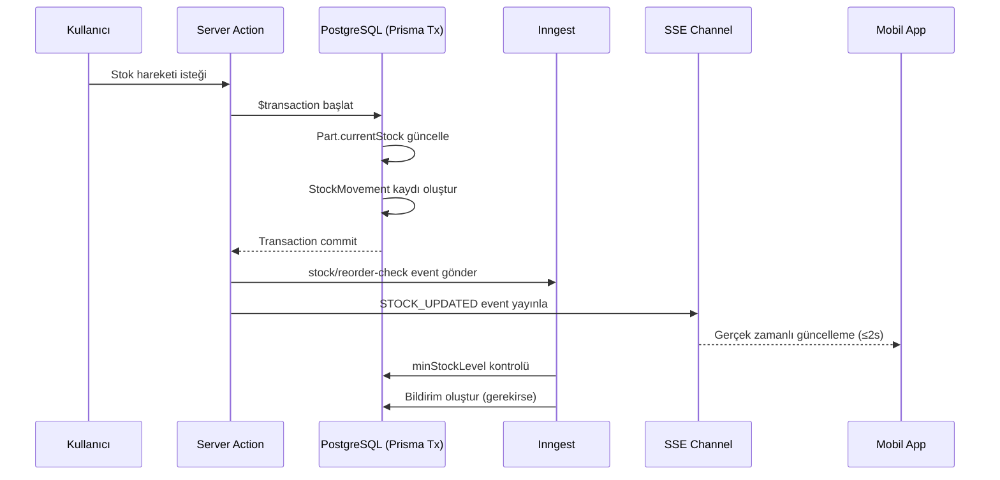
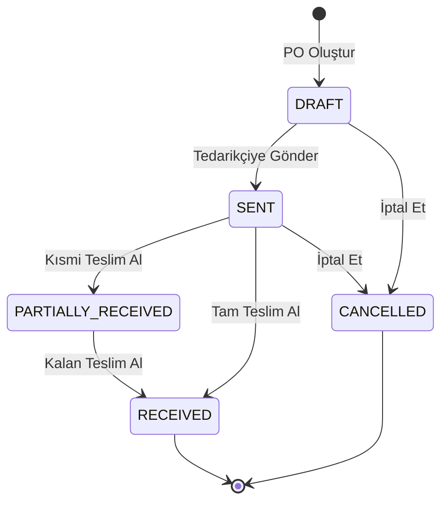
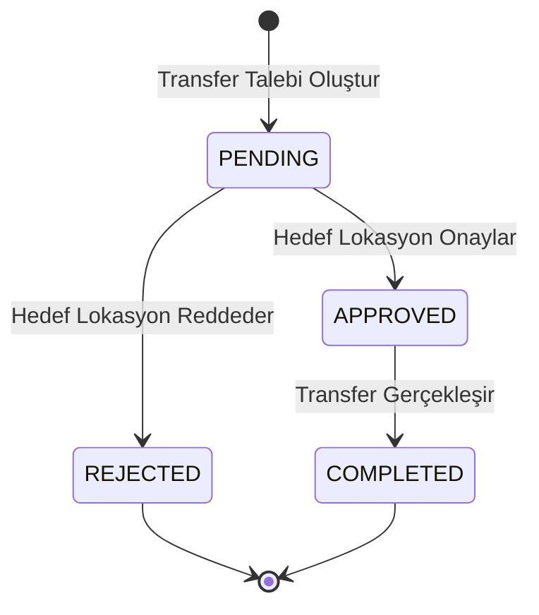

# Stok ve Parça Yönetimi - Tasarım Belgesi

## Genel Bakış

Bu belge, MS Oto Servis SaaS platformunun **Stok & Parça Yönetimi** modülünün genişletilmiş tasarımını tanımlar. Mevcut temel envanter altyapısı (`Part`, `PartCategory`, `StockMovement`, `Supplier`, `Location`) üzerine sekiz kritik özellik eklenerek tam kapsamlı bir stok yönetim sistemi oluşturulacaktır.

### Kapsam

| Özellik | Açıklama |
|---------|----------|
| Barkod/QR Okuma | Web kamerası ve mobil kamera ile hızlı stok girişi |
| Otomatik Reorder | Inngest job ile stok seviyesi izleme ve uyarı |
| Stok Sayım Modülü | Periyodik envanter sayımı ve fark düzeltme |
| Parça İade Akışı | Servis-depo ve tedarikçi iade işlemleri |
| Çoklu Lokasyon Transferi | Şubeler arası parça transfer ve onay akışı |
| Gelişmiş Raporlama | Stok değer, hareket geçmişi, kritik stok raporları |
| PO Yönetimi | Tedarikçi satın alma siparişi yaşam döngüsü |
| Mobil Senkronizasyon | SSE ile gerçek zamanlı web-mobil stok senkronizasyonu |

### Tasarım Kararları

- **Barkod kütüphanesi**: Web'de `@zxing/library`, mobilde `expo-camera` + `expo-barcode-scanner` — her iki platform için native destek sağlar, ek backend gerektirmez.
- **Reorder motoru**: Inngest job (`stock/reorder-check`) — her `StockMovement` sonrası event-driven tetikleme, 24 saatlik debounce için Upstash Redis kullanılır.
- **SSE genişletme**: Mevcut `lib/sse.ts` altyapısına `STOCK_UPDATED` event tipi eklenir; yeni SSE endpoint `/api/sse/stock` oluşturulur.
- **Transaction bütünlüğü**: Tüm stok değiştiren işlemler Prisma `$transaction` içinde gerçekleştirilir; kısmi başarı durumunda rollback garantisi.
- **PDF export**: Mevcut `lib/pdf-utils.ts` (`exportElementToPdf`) kullanılır; CSV için `papaparse` kütüphanesi eklenir.
- **Lokasyon bazlı stok**: `Part.locationId` alanı mevcut; çoklu lokasyon stok takibi bu alan üzerinden yapılır.

---

## Mimari

### Katmanlı Mimari

```
┌─────────────────────────────────────────────────────────────────┐
│                        Presentation Layer                        │
│  Next.js App Router Pages  │  Expo React Native Screens         │
│  /dashboard/inventory/*    │  apps/mobile/app/(firma)/stok*     │
└────────────────────────────┬────────────────────────────────────┘
                             │
┌────────────────────────────▼────────────────────────────────────┐
│                      Application Layer                           │
│  Server Actions (lib/actions/)                                   │
│  purchase-order.actions.ts │ stock-count.actions.ts             │
│  stock-transfer.actions.ts │ inventory.actions.ts (genişletildi)│
└────────────────────────────┬────────────────────────────────────┘
                             │
┌────────────────────────────▼────────────────────────────────────┐
│                    Infrastructure Layer                          │
│  Prisma ORM (PostgreSQL)  │  Inngest (Background Jobs)          │
│  Upstash Redis (Cache)    │  SSE (Real-time)                    │
│  AWS S3 (Storage)         │  Resend (Email)                     │
└─────────────────────────────────────────────────────────────────┘
```

### Veri Akışı: Stok Hareketi



### Veri Akışı: Satın Alma Siparişi



### Veri Akışı: Stok Transferi



---

## Bileşenler ve Arayüzler

### 1. Server Actions

#### `lib/actions/purchase-order.actions.ts`

```typescript
// Yeni PurchaseOrder oluştur
createPurchaseOrder(data: CreatePurchaseOrderInput): Promise<ActionResult<{ poId: string }>>

// PO'yu tedarikçiye gönder (DRAFT → SENT)
sendPurchaseOrder(poId: string): Promise<ActionResult>

// Teslim alım işlemi (kısmi veya tam)
receivePurchaseOrder(poId: string, items: ReceiveItemInput[]): Promise<ActionResult>

// PO iptal et
cancelPurchaseOrder(poId: string): Promise<ActionResult>

// PO listesi
getPurchaseOrders(filters?: POFilters): Promise<ActionResult<{ orders: PurchaseOrder[] }>>

// PO detayı
getPurchaseOrderById(poId: string): Promise<ActionResult<{ order: PurchaseOrderDetail }>>
```

#### `lib/actions/stock-count.actions.ts`

```typescript
// Yeni sayım oturumu başlat
createStockCount(data: CreateStockCountInput): Promise<ActionResult<{ countId: string }>>

// Fiili miktar güncelle
updateStockCountItem(countId: string, partId: string, actualQuantity: number): Promise<ActionResult>

// Sayımı onayla (DRAFT → COMPLETED)
approveStockCount(countId: string): Promise<ActionResult<{ adjustments: number }>>

// Sayım listesi
getStockCounts(filters?: CountFilters): Promise<ActionResult<{ counts: StockCount[] }>>

// Sayım detayı (fark raporu dahil)
getStockCountDetail(countId: string): Promise<ActionResult<{ count: StockCountDetail }>>
```

#### `lib/actions/stock-transfer.actions.ts`

```typescript
// Transfer talebi oluştur
createStockTransfer(data: CreateStockTransferInput): Promise<ActionResult<{ transferId: string }>>

// Transfer onayla (PENDING → APPROVED → COMPLETED)
approveStockTransfer(transferId: string): Promise<ActionResult>

// Transfer reddet (PENDING → REJECTED)
rejectStockTransfer(transferId: string, reason: string): Promise<ActionResult>

// Transfer listesi
getStockTransfers(filters?: TransferFilters): Promise<ActionResult<{ transfers: StockTransfer[] }>>
```

#### `lib/actions/inventory.actions.ts` (Genişletmeler)

```typescript
// Barkod ile parça ara
findPartByBarcode(barcode: string): Promise<ActionResult<{ part: Part | null }>>

// Hızlı stok girişi (barkod tarama sonrası)
quickStockEntry(partId: string, quantity: number, reason?: string): Promise<ActionResult>

// Parça iadesi (servis → depo)
returnPartFromService(data: ServiceReturnInput): Promise<ActionResult>

// Tedarikçiye iade
returnPartToSupplier(data: SupplierReturnInput): Promise<ActionResult>

// Stok değer raporu
getStockValueReport(filters?: ReportFilters): Promise<ActionResult<StockValueReport>>

// Hareket geçmişi raporu
getStockMovementReport(filters: MovementReportFilters): Promise<ActionResult<MovementReport>>

// En çok kullanılan parçalar
getTopUsedParts(dateRange: DateRange, limit?: number): Promise<ActionResult<TopPartsReport>>

// Kritik stok raporu
getCriticalStockReport(): Promise<ActionResult<CriticalStockReport>>
```

### 2. Inngest Job: Reorder Kontrolü

#### `lib/inngest/functions/stock-reorder-check.ts`

```typescript
// Event: stock/movement.created
// Tetikleyici: Her StockMovement oluşturulduğunda
export const stockReorderCheckFunction = inngest.createFunction(
  { id: "stock-reorder-check", name: "Stok Yeniden Sipariş Kontrolü" },
  { event: "stock/movement.created" },
  async ({ event, step }) => {
    // 1. Part.currentStock <= Part.minStockLevel kontrolü
    // 2. minStockLevel > 0 kontrolü (0 ise uyarı gönderme)
    // 3. 24 saatlik debounce: Redis'te son uyarı zamanını kontrol et
    // 4. Bildirim oluştur (TENANT_ADMIN + ACCOUNTANT rollerine)
    // 5. Taslak PO önerisi oluştur (Supplier bağlıysa)
  }
);
```

**Redis Debounce Anahtarı**: `reorder:alert:{tenantId}:{partId}` — TTL: 86400 saniye (24 saat)

### 3. SSE Genişletmesi

#### `lib/sse.ts` Güncellemesi

```typescript
export type SSEEventType =
  | "SERVICE_ORDER_UPDATED"
  | "APPOINTMENT_CREATED"
  | "APPROVAL_RESPONDED"
  | "STOCK_UPDATED"        // YENİ
  | "PING";

export interface StockUpdatedPayload {
  partId: string;
  partNumber: string;
  partName: string;
  newStock: number;
  movementType: "IN" | "OUT" | "ADJUST";
  locationId?: string;
}
```

#### Yeni SSE Endpoint: `app/api/sse/stock/route.ts`

Mevcut SSE endpoint yapısına paralel olarak stok güncellemelerine özel bir SSE stream endpoint'i oluşturulur. Mobil uygulama bu endpoint'e bağlanarak gerçek zamanlı stok güncellemelerini alır.

### 4. Barkod Tarama Bileşeni

#### Web: `components/dashboard/inventory/BarcodeScanner.tsx`

```typescript
interface BarcodeScannerProps {
  onScan: (barcode: string) => void;
  onError?: (error: Error) => void;
  mode?: "camera" | "manual"; // Kamera yoksa manuel mod
}
```

`@zxing/library` kullanılır. Kamera izni reddedildiğinde otomatik olarak manuel metin girişi moduna geçer.

#### Mobil: `apps/mobile/app/(firma)/barkod.tsx` (Genişletme)

Mevcut `barkod.tsx` sayfası stok girişi akışıyla entegre edilir. `expo-camera` + `expo-barcode-scanner` kullanılır.

### 5. Sayfa Yapısı (Next.js App Router)

```
app/(dashboard)/dashboard/inventory/
├── page.tsx                    # Mevcut — genişletilecek
├── purchase-orders/
│   ├── page.tsx                # PO listesi
│   ├── new/page.tsx            # Yeni PO oluştur
│   └── [id]/page.tsx           # PO detayı + teslim alım
├── stock-counts/
│   ├── page.tsx                # Sayım listesi
│   ├── new/page.tsx            # Yeni sayım başlat
│   └── [id]/page.tsx           # Sayım detayı + onay
├── transfers/
│   ├── page.tsx                # Transfer listesi
│   ├── new/page.tsx            # Yeni transfer talebi
│   └── [id]/page.tsx           # Transfer detayı + onay
└── reports/
    └── page.tsx                # Raporlar (değer, hareket, kritik)
```

---

## Veri Modelleri

### Yeni Prisma Modelleri

#### `PurchaseOrder`

```prisma
enum PurchaseOrderStatus {
  DRAFT
  SENT
  PARTIALLY_RECEIVED
  RECEIVED
  CANCELLED
}

model PurchaseOrder {
  id              String               @id @default(uuid())
  tenantId        String
  tenant          Tenant               @relation(fields: [tenantId], references: [id], onDelete: Cascade)

  poNumber        String               @db.VarChar(50)  // Örn: PO-2024-0001
  supplierId      String
  supplier        Supplier             @relation(fields: [supplierId], references: [id], onDelete: Restrict)

  status          PurchaseOrderStatus  @default(DRAFT)
  expectedDate    DateTime?            @db.Date
  notes           String?              @db.Text

  subTotal        Decimal              @default(0) @db.Decimal(15, 2)
  taxAmount       Decimal              @default(0) @db.Decimal(15, 2)
  totalAmount     Decimal              @default(0) @db.Decimal(15, 2)

  items           PurchaseOrderItem[]
  stockMovements  StockMovement[]

  createdById     String?
  sentAt          DateTime?
  receivedAt      DateTime?

  createdAt       DateTime             @default(now())
  updatedAt       DateTime             @updatedAt
  deletedAt       DateTime?

  @@unique([poNumber, tenantId])
  @@index([tenantId])
  @@index([supplierId])
  @@index([status])
}

model PurchaseOrderItem {
  id               String        @id @default(uuid())
  purchaseOrderId  String
  purchaseOrder    PurchaseOrder @relation(fields: [purchaseOrderId], references: [id], onDelete: Cascade)

  partId           String
  part             Part          @relation(fields: [partId], references: [id], onDelete: Restrict)

  quantity         Decimal       @db.Decimal(15, 2)
  unitPrice        Decimal       @db.Decimal(15, 2)
  taxRate          Decimal       @default(20) @db.Decimal(5, 2)
  receivedQuantity Decimal       @default(0) @db.Decimal(15, 2)

  createdAt        DateTime      @default(now())
  updatedAt        DateTime      @updatedAt

  @@index([purchaseOrderId])
  @@index([partId])
}
```

#### `StockCount`

```prisma
enum StockCountStatus {
  DRAFT
  IN_PROGRESS
  COMPLETED
}

model StockCount {
  id          String           @id @default(uuid())
  tenantId    String
  tenant      Tenant           @relation(fields: [tenantId], references: [id], onDelete: Cascade)

  locationId  String?
  location    Location?        @relation(fields: [locationId], references: [id], onDelete: SetNull)

  status      StockCountStatus @default(DRAFT)
  notes       String?          @db.Text

  startedAt   DateTime         @default(now())
  completedAt DateTime?

  items       StockCountItem[]

  createdById String?

  createdAt   DateTime         @default(now())
  updatedAt   DateTime         @updatedAt

  @@index([tenantId])
  @@index([locationId])
  @@index([status])
}

model StockCountItem {
  id             String     @id @default(uuid())
  stockCountId   String
  stockCount     StockCount @relation(fields: [stockCountId], references: [id], onDelete: Cascade)

  partId         String
  part           Part       @relation(fields: [partId], references: [id], onDelete: Restrict)

  systemQuantity Int        // Sayım başlangıcındaki sistem değeri (snapshot)
  actualQuantity Int?       // Kullanıcının girdiği fiili miktar
  difference     Int?       // actualQuantity - systemQuantity (hesaplanmış)

  createdAt      DateTime   @default(now())
  updatedAt      DateTime   @updatedAt

  @@unique([stockCountId, partId])
  @@index([stockCountId])
  @@index([partId])
}
```

#### `StockTransfer`

```prisma
enum StockTransferStatus {
  PENDING
  APPROVED
  REJECTED
  COMPLETED
}

model StockTransfer {
  id               String              @id @default(uuid())
  tenantId         String
  tenant           Tenant              @relation(fields: [tenantId], references: [id], onDelete: Cascade)

  fromLocationId   String
  fromLocation     Location            @relation("TransferFrom", fields: [fromLocationId], references: [id], onDelete: Restrict)

  toLocationId     String
  toLocation       Location            @relation("TransferTo", fields: [toLocationId], references: [id], onDelete: Restrict)

  status           StockTransferStatus @default(PENDING)
  notes            String?             @db.Text
  rejectionReason  String?             @db.Text

  requestedById    String?
  approvedById     String?

  requestedAt      DateTime            @default(now())
  approvedAt       DateTime?
  completedAt      DateTime?

  items            StockTransferItem[]

  createdAt        DateTime            @default(now())
  updatedAt        DateTime            @updatedAt

  @@index([tenantId])
  @@index([fromLocationId])
  @@index([toLocationId])
  @@index([status])
}

model StockTransferItem {
  id              String        @id @default(uuid())
  stockTransferId String
  stockTransfer   StockTransfer @relation(fields: [stockTransferId], references: [id], onDelete: Cascade)

  partId          String
  part            Part          @relation(fields: [partId], references: [id], onDelete: Restrict)

  quantity        Decimal       @db.Decimal(15, 2)

  createdAt       DateTime      @default(now())
  updatedAt       DateTime      @updatedAt

  @@index([stockTransferId])
  @@index([partId])
}
```

### Mevcut Model Güncellemeleri

#### `StockMovement` Güncellemesi

```prisma
model StockMovement {
  // Mevcut alanlar korunur, yeni ilişkiler eklenir:
  purchaseOrderId  String?
  purchaseOrder    PurchaseOrder? @relation(fields: [purchaseOrderId], references: [id], onDelete: SetNull)

  stockCountId     String?
  stockCount       StockCount?    @relation(fields: [stockCountId], references: [id], onDelete: SetNull)

  stockTransferId  String?
  stockTransfer    StockTransfer? @relation(fields: [stockTransferId], references: [id], onDelete: SetNull)

  locationId       String?        // Hareketin gerçekleştiği lokasyon
  location         Location?      @relation(fields: [locationId], references: [id], onDelete: SetNull)
}
```

#### `Supplier` Güncellemesi

```prisma
model Supplier {
  // Mevcut alanlar korunur:
  purchaseOrders   PurchaseOrder[]  // YENİ ilişki
}
```

#### `Part` Güncellemesi

```prisma
model Part {
  // Mevcut alanlar korunur, yeni ilişkiler eklenir:
  purchaseOrderItems  PurchaseOrderItem[]
  stockCountItems     StockCountItem[]
  stockTransferItems  StockTransferItem[]
}
```

### Zod Validasyon Şemaları

#### `lib/validations/purchase-order.ts`

```typescript
export const createPurchaseOrderSchema = z.object({
  supplierId: z.string().uuid(),
  expectedDate: z.date().optional(),
  notes: z.string().max(1000).optional(),
  items: z.array(z.object({
    partId: z.string().uuid(),
    quantity: z.number().positive(),
    unitPrice: z.number().positive(),
    taxRate: z.number().min(0).max(100).default(20),
  })).min(1, "En az bir kalem gereklidir"),
});

export const receiveItemsSchema = z.object({
  items: z.array(z.object({
    itemId: z.string().uuid(),
    receivedQuantity: z.number().min(0),
  })),
});
```

#### `lib/validations/stock-count.ts`

```typescript
export const createStockCountSchema = z.object({
  locationId: z.string().uuid().optional(),
  categoryIds: z.array(z.string().uuid()).optional(),
  notes: z.string().max(1000).optional(),
});

export const updateStockCountItemSchema = z.object({
  actualQuantity: z.number().int().min(0),
});
```

#### `lib/validations/stock-transfer.ts`

```typescript
export const createStockTransferSchema = z.object({
  fromLocationId: z.string().uuid(),
  toLocationId: z.string().uuid(),
  notes: z.string().max(1000).optional(),
  items: z.array(z.object({
    partId: z.string().uuid(),
    quantity: z.number().positive(),
  })).min(1),
}).refine(
  (data) => data.fromLocationId !== data.toLocationId,
  { message: "Kaynak ve hedef lokasyon aynı olamaz" }
);
```

---
