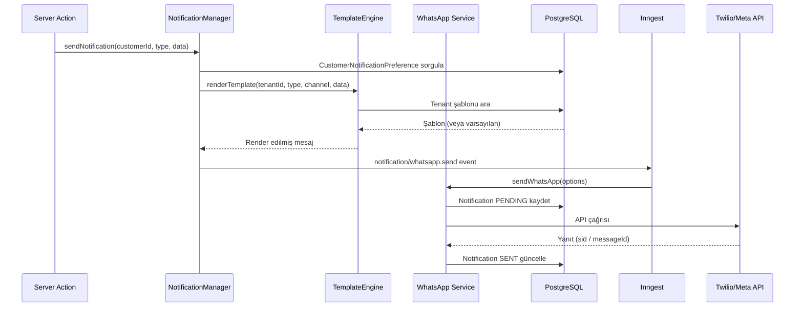
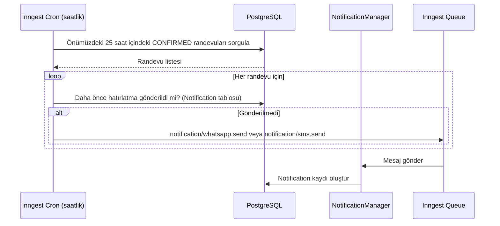
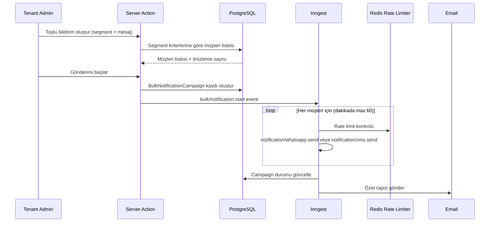

# WhatsApp ve Gelişmiş Bildirim Sistemi — Tasarım Belgesi

## Genel Bakış

Bu belge, MS Oto Servis SaaS platformunun **WhatsApp ve Gelişmiş Bildirim Sistemi** modülünün teknik tasarımını tanımlar.

Türkiye'de WhatsApp kullanım oranı %90'ın üzerindedir. Mevcut platformda `NotificationProvider` şemasında `WHATSAPP` tipi tanımlı olmasına rağmen `lib/notifications/whatsapp.ts` implementasyonu bulunmamaktadır. Bu tasarım; eksik WhatsApp servisini hayata geçirir, mevcut SMS/Email altyapısını genişletir ve şu bileşenleri kapsar:

| Bileşen | Açıklama |
|---------|----------|
| `lib/notifications/whatsapp.ts` | Twilio WhatsApp + Meta Cloud API çift sağlayıcı desteği |
| `lib/notifications/template-engine.ts` | Tenant bazlı özelleştirilebilir şablon motoru |
| `lib/notifications/notification-manager.ts` | Kanal yönlendirme ve fallback orkestrasyon katmanı |
| Inngest Jobs | `send-whatsapp`, `appointment-reminder`, `bulk-notification` |
| Prisma Schema | `NotificationTemplate`, `CustomerNotificationPreference`, `BulkNotificationCampaign` yeni modelleri |
| Dashboard UI | `/dashboard/notifications/*` yönetim sayfaları |
| Müşteri Portalı | `/m/musteri` bildirim tercihleri ve geçmişi |

### Tasarım Kararları

- **Çift sağlayıcı stratejisi**: Twilio WhatsApp serbest metin destekler; Meta Cloud API yalnızca onaylı HSM şablonları kullanır. Sağlayıcı tipi `NotificationProvider.provider` alanından (`TWILIO_WHATSAPP` | `META_CLOUD_API`) belirlenir.
- **Şablon motoru**: Mevcut `lib/notifications/templates.ts` hardcoded şablonları korunur; yeni `NotificationTemplate` modeli tenant bazlı override sağlar. Fallback zinciri: Tenant Şablonu → Varsayılan Şablon.
- **Kanal fallback sırası**: WhatsApp → SMS → Email. `CustomerNotificationPreference` yoksa tenant varsayılan kanalı kullanılır.
- **Telefon normalizasyonu**: `0XXXXXXXXXX` → `+90XXXXXXXXXX` dönüşümü merkezi `normalizePhone()` fonksiyonunda yapılır; tüm kanallar bu fonksiyonu kullanır.
- **Toplu bildirim hız sınırı**: Dakikada 60 mesaj. Upstash Redis sliding window ile uygulanır.
- **API anahtarı şifreleme**: `NotificationProvider.settings` içindeki hassas alanlar AES-256-GCM ile şifrelenir; görüntülemede yalnızca son 4 karakter gösterilir.
- **Simülasyon modu**: Aktif sağlayıcı yoksa `metadata: { simulated: true }` ile `SENT` kaydedilir; geliştirme ortamında gerçek API çağrısı yapılmaz.

---

## Mimari

### Katmanlı Mimari

```
+------------------------------------------------------------------+
|                       Presentation Layer                         |
|  Next.js App Router (dashboard)   |  Expo React Native (mobile)  |
|  /dashboard/notifications/*       |  apps/mobile/(musteri)/      |
|  /dashboard/settings/notifications|  bildirimler.tsx             |
|  /m/musteri (tercihler, geçmiş)   |                              |
+-----------------------------------+------------------------------+
                                    |
+-----------------------------------v------------------------------+
|                       Application Layer                          |
|  Server Actions (lib/actions/)                                   |
|  notification.actions.ts  |  template.actions.ts                 |
|  preference.actions.ts    |  bulk-notification.actions.ts        |
|  API Routes: /api/webhooks/whatsapp                              |
+-----------------------------------+------------------------------+
                                    |
+-----------------------------------v------------------------------+
|                    Service Layer (lib/notifications/)            |
|  whatsapp.ts          |  notification-manager.ts                 |
|  template-engine.ts   |  dispatch.ts (genişletilmiş)             |
|  sms.ts (mevcut)      |  email.ts (mevcut)                       |
+-----------------------------------+------------------------------+
                                    |
+-----------------------------------v------------------------------+
|                    Infrastructure Layer                          |
|  Prisma ORM (PostgreSQL)  |  Inngest (Background Jobs)           |
|  Upstash Redis (Rate Limit)|  Twilio WhatsApp API                |
|  Meta Cloud API (WhatsApp) |  Resend (Email)                     |
|  Sentry (Error Monitoring) |                                      |
+------------------------------------------------------------------+
```

### Veri Akışı: WhatsApp Mesaj Gönderimi



### Veri Akışı: Randevu Hatırlatma Otomasyonu



### Veri Akışı: Toplu Bildirim



---

## Bileşenler ve Arayüzler

### 1. WhatsApp Servisi (`lib/notifications/whatsapp.ts`)

Mevcut `sms.ts` ile aynı yapıyı izler; iki sağlayıcıyı destekler.

```typescript
interface SendWhatsAppOptions {
  to: string;           // +90XXXXXXXXXX formatında (normalize edilmiş)
  body: string;         // Serbest metin (Twilio) veya HSM parametreleri
  tenantId: string;
  customerId?: string;
  templateName?: string;    // Meta Cloud API için HSM şablon adı
  templateParams?: string[]; // HSM şablon parametreleri
  languageCode?: string;    // HSM dil kodu (varsayılan: "tr")
}

interface WhatsAppResult {
  success: boolean;
  messageId?: string;
  error?: string;
  simulated?: boolean;
}

export async function sendWhatsApp(options: SendWhatsAppOptions): Promise<WhatsAppResult>
```

**Sağlayıcı Seçim Mantığı:**
1. `NotificationProvider` tablosunda `type: "WHATSAPP"`, `isActive: true` kaydı ara
2. `provider === "TWILIO_WHATSAPP"` → Twilio SDK, `whatsapp:+90XXXXXXXXXX` formatı
3. `provider === "META_CLOUD_API"` → Meta Graph API, HSM şablon zorunlu
4. Sağlayıcı yoksa → Simülasyon modu

### 2. Şablon Motoru (`lib/notifications/template-engine.ts`)

```typescript
interface RenderOptions {
  tenantId: string;
  type: TemplateType;   // "SERVICE_STATUS" | "APPROVAL" | "APPOINTMENT" | "QUOTE" | "REMINDER" | "BULK"
  channel: "SMS" | "WHATSAPP" | "EMAIL";
  variables: Record<string, string>;
}

interface ParsedTemplate {
  body: string;
  variables: string[];  // Tespit edilen değişken adları
}

// Şablon ayrıştırma: {{değişken}} formatındaki tüm değişkenleri tespit eder
export function parseTemplate(body: string): ParsedTemplate

// Şablon render: değişkenleri değerlerle değiştirir
// Eksik değişkenler [değişken_adı] formatında bırakılır
export function renderTemplate(template: string, variables: Record<string, string>): string

// Tenant şablonu çözümleme: DB → varsayılan fallback
export async function resolveTemplate(options: RenderOptions): Promise<string>

// Değişken doğrulama: zorunlu değişkenlerin varlığını kontrol eder
export function validateTemplateVariables(body: string, requiredVars: string[]): { valid: boolean; missing: string[] }
```

**Desteklenen Değişkenler:**
`{{musteriAdi}}`, `{{aracPlaka}}`, `{{isEmriNo}}`, `{{durum}}`, `{{tutar}}`, `{{randevuTarihi}}`, `{{randevuSaati}}`, `{{onayUrl}}`

### 3. Bildirim Yöneticisi (`lib/notifications/notification-manager.ts`)

```typescript
interface NotificationRequest {
  tenantId: string;
  customerId: string;
  type: TemplateType;
  variables: Record<string, string>;
  forceChannel?: "SMS" | "WHATSAPP" | "EMAIL"; // Zorunlu kanal (opsiyonel)
}

interface NotificationResult {
  channel: string;
  status: "SENT" | "SKIPPED" | "FAILED";
  notificationId?: string;
}

// Ana orkestrasyon fonksiyonu
export async function sendNotification(request: NotificationRequest): Promise<NotificationResult>

// Kanal seçim mantığı: tercih → fallback → SKIPPED
// Öncelik: WhatsApp → SMS → Email
async function resolveChannel(tenantId: string, customerId: string): Promise<"SMS" | "WHATSAPP" | "EMAIL" | null>
```

### 4. Dispatch Katmanı (genişletilmiş `lib/notifications/dispatch.ts`)

```typescript
interface WhatsAppDispatchOptions {
  to: string;
  body: string;
  tenantId: string;
  customerId?: string;
  templateName?: string;
  templateParams?: string[];
}

// Mevcut dispatchSms ve dispatchEmail korunur
export async function dispatchWhatsApp(options: WhatsAppDispatchOptions): Promise<void>
```

### 5. Webhook Handler (`app/api/webhooks/whatsapp/route.ts`)

Meta Cloud API'den gelen durum güncellemelerini işler:

```typescript
// POST /api/webhooks/whatsapp
// Payload: { entry: [{ changes: [{ value: { statuses: [{ id, status, timestamp }] } }] }] }
// status: "delivered" | "read" | "failed"
// Notification kaydını günceller: SENT → DELIVERED/READ veya FAILED
```

---

## Veri Modelleri

### Mevcut Modeller (Genişletme)

**`Notification` modeli** — yeni alanlar:

```prisma
model Notification {
  // ... mevcut alanlar ...
  
  // Yeni alanlar
  notificationTemplateId String?              // Kullanılan şablon referansı
  notificationTemplate   NotificationTemplate? @relation(fields: [notificationTemplateId], references: [id], onDelete: SetNull)
  reminderType           String?              @db.VarChar(50)  // "24H" | "2H" (randevu hatırlatma tipi)
  appointmentId          String?              // Randevu bağlantısı
  bulkCampaignId         String?              // Toplu kampanya bağlantısı
  bulkCampaign           BulkNotificationCampaign? @relation(fields: [bulkCampaignId], references: [id], onDelete: SetNull)
}
```

**`NotificationType` enum** — yeni değer:

```prisma
enum NotificationType {
  SMS
  EMAIL
  IN_APP
  WHATSAPP  // Yeni
}
```

**`NotificationStatus` enum** — yeni değerler:

```prisma
enum NotificationStatus {
  PENDING
  SENT
  FAILED
  SKIPPED    // Yeni: müşteri tüm kanalları devre dışı bırakmış
  DELIVERED  // Yeni: WhatsApp webhook onayı
  READ       // Yeni: WhatsApp okundu onayı
}
```

### Yeni Modeller

```prisma
// Tenant bazlı özelleştirilebilir bildirim şablonları
model NotificationTemplate {
  id           String    @id @default(uuid())
  tenantId     String
  tenant       Tenant    @relation(fields: [tenantId], references: [id], onDelete: Cascade)
  
  type         String    @db.VarChar(50)   // "SERVICE_STATUS" | "APPROVAL" | "APPOINTMENT" | "QUOTE" | "REMINDER" | "BULK"
  channel      String    @db.VarChar(20)   // "SMS" | "WHATSAPP" | "EMAIL"
  name         String    @db.VarChar(255)  // Şablon adı (yönetici için)
  body         String    @db.Text          // {{değişken}} formatında şablon gövdesi
  variables    String[]                    // Tespit edilen değişken listesi (otomatik)
  
  // Meta Cloud API HSM alanları (WhatsApp kanalı için)
  templateName String?   @db.VarChar(255)  // Meta HSM şablon adı
  languageCode String?   @db.VarChar(10)   // "tr" | "en"
  
  isActive     Boolean   @default(true)
  isDefault    Boolean   @default(false)   // Tenant varsayılanı
  
  notifications Notification[]
  
  createdAt    DateTime  @default(now())
  updatedAt    DateTime  @updatedAt
  deletedAt    DateTime?                   // Soft-delete

  @@unique([tenantId, type, channel])
  @@index([tenantId])
  @@index([type])
}

// Müşteri bildirim kanalı tercihleri
model CustomerNotificationPreference {
  id               String   @id @default(uuid())
  tenantId         String
  customerId       String
  
  smsEnabled       Boolean  @default(true)
  whatsappEnabled  Boolean  @default(false)
  emailEnabled     Boolean  @default(true)
  preferredChannel String   @default("SMS") @db.VarChar(20) // "SMS" | "WHATSAPP" | "EMAIL"
  
  tenant           Tenant   @relation(fields: [tenantId], references: [id], onDelete: Cascade)
  customer         Customer @relation(fields: [customerId], references: [id], onDelete: Cascade)
  
  createdAt        DateTime @default(now())
  updatedAt        DateTime @updatedAt

  @@unique([tenantId, customerId])
  @@index([tenantId])
  @@index([customerId])
}

// Toplu bildirim kampanyaları
model BulkNotificationCampaign {
  id              String    @id @default(uuid())
  tenantId        String
  tenant          Tenant    @relation(fields: [tenantId], references: [id], onDelete: Cascade)
  
  name            String    @db.VarChar(255)
  channel         String    @db.VarChar(20)   // "SMS" | "WHATSAPP"
  messageBody     String    @db.Text
  
  // Segment kriterleri (JSON)
  segmentType     String    @db.VarChar(50)   // "ALL" | "OVERDUE_INVOICE" | "VEHICLE_BRAND" | "INACTIVE" | "ACTIVE"
  segmentParams   Json?     @default("{}")    // { days: 30, brand: "Toyota" } gibi
  
  // İstatistikler
  totalCount      Int       @default(0)
  sentCount       Int       @default(0)
  failedCount     Int       @default(0)
  skippedCount    Int       @default(0)
  
  status          String    @default("DRAFT") @db.VarChar(20) // "DRAFT" | "RUNNING" | "COMPLETED" | "FAILED"
  startedAt       DateTime?
  completedAt     DateTime?
  
  createdById     String?
  notifications   Notification[]
  
  createdAt       DateTime  @default(now())
  updatedAt       DateTime  @updatedAt

  @@index([tenantId])
  @@index([status])
}
```

### Tenant ve Customer İlişki Güncellemeleri

`Tenant` modeline eklenecek ilişkiler:
```prisma
notificationTemplates          NotificationTemplate[]
customerNotificationPreferences CustomerNotificationPreference[]
bulkNotificationCampaigns      BulkNotificationCampaign[]
```

`Customer` modeline eklenecek ilişki:
```prisma
notificationPreference CustomerNotificationPreference?
```

---

## Doğruluk Özellikleri

*Bir özellik (property), bir sistemin tüm geçerli çalışmalarında doğru olması gereken bir karakteristik veya davranıştır — temelde sistemin ne yapması gerektiğine dair biçimsel bir ifadedir. Özellikler, insan tarafından okunabilir spesifikasyonlar ile makine tarafından doğrulanabilir doğruluk garantileri arasındaki köprüyü oluşturur.*

### Property 1: Telefon Numarası Normalizasyonu

*Herhangi bir* Türkiye telefon numarası için (0 ile başlayan, +90 ile başlayan veya 10 haneli), `normalizePhone()` fonksiyonu her zaman `+90XXXXXXXXXX` formatında bir sonuç üretmelidir.

**Validates: Requirements 1.7**

### Property 2: WhatsApp Gönderim Kaydı

*Herhangi bir* geçerli WhatsApp gönderim isteği için, gönderim tamamlandıktan sonra `Notification` tablosunda `type: "WHATSAPP"` ile bir kayıt bulunmalıdır; başarılı gönderimde `status: "SENT"`, API hatasında `status: "FAILED"` olmalıdır.

**Validates: Requirements 1.3, 1.4**

### Property 3: Webhook Durum Güncellemesi

*Herhangi bir* geçerli Meta Cloud API webhook payload'ı için (`delivered`, `read`, `failed` durumları), `/api/webhooks/whatsapp` endpoint'i ilgili `Notification` kaydını doğru duruma güncellemelidir.

**Validates: Requirements 1.10**

### Property 4: Kanal Fallback Sırası

*Herhangi bir* müşteri tercih kombinasyonu ve sağlayıcı aktiflik durumu için, `NotificationManager` kanal seçiminde WhatsApp → SMS → Email öncelik sırasını korumalıdır; tercih edilen kanal için aktif sağlayıcı yoksa bir sonraki kanala geçmelidir.

**Validates: Requirements 2.2, 2.3**

### Property 5: Randevu Hatırlatma İdempotansı

*Herhangi bir* onaylanmış randevu için, `appointment-reminder` Inngest job'ı birden fazla kez çalıştırıldığında aynı hatırlatma tipi (24H veya 2H) için yalnızca bir `Notification` kaydı oluşturulmalıdır.

**Validates: Requirements 3.5**

### Property 6: Şablon Değişken Tespiti

*Herhangi bir* şablon metni için, `parseTemplate()` fonksiyonu `{{değişken}}` formatındaki tüm değişkenleri eksiksiz tespit etmeli; fazladan veya eksik değişken döndürmemelidir.

**Validates: Requirements 9.1, 5.3**

### Property 7: Şablon Render Round-Trip

*Herhangi bir* şablon metni ve değişken değerleri seti için, `renderTemplate(template, variables)` işlemi tüm `{{değişken}}` yer tutucularını sağlanan değerlerle değiştirmeli; aynı girdi için her zaman aynı çıktıyı üretmelidir (idempotent).

**Validates: Requirements 9.2, 9.3, 9.5**

### Property 8: Eksik Değişken İşleme

*Herhangi bir* şablon ve eksik değişken kombinasyonu için, `renderTemplate()` eksik değişkeni boş string ile değil `[değişken_adı]` formatında bırakmalıdır.

**Validates: Requirements 9.4**

### Property 9: Şablon Çözümleme Fallback

*Herhangi bir* tenant ve bildirim tipi kombinasyonu için, `resolveTemplate()` önce tenant'a özgü şablonu aramalı; bulunamazsa `lib/notifications/templates.ts` içindeki varsayılan şablona dönmelidir; her iki durumda da geçerli bir şablon metni döndürmelidir.

**Validates: Requirements 5.2**

### Property 10: Toplu Bildirim Tercih Filtresi

*Herhangi bir* toplu bildirim kampanyası için, ilgili kanalı devre dışı bırakan müşteriler gönderim listesinden çıkarılmalı ve `status: "SKIPPED"` ile kaydedilmelidir.

**Validates: Requirements 6.8, 2.4**

---

## Hata Yönetimi

### Hata Kategorileri ve Stratejileri

| Hata Tipi | Strateji | Yeniden Deneme |
|-----------|----------|----------------|
| API bağlantı hatası (5xx) | Inngest retry | 3 kez, exponential backoff |
| Geçersiz telefon numarası | Validation hatası, FAILED kayıt | Hayır |
| Geçersiz HSM şablon adı | FAILED kayıt, hata mesajında şablon adı | Hayır |
| Sağlayıcı bulunamadı | Simülasyon modu | Hayır |
| Rate limit aşımı | Kuyruğa al, geciktir | Otomatik |
| Webhook imza doğrulama hatası | 401 dön, log yaz | Hayır |
| Şablon değişken eksikliği | [değişken_adı] formatı, uyarı log | Hayır |
| Tüm denemeler başarısız | Tenant admin'e e-posta | - |

### Hata Akışı: Randevu Hatırlatma Başarısızlığı

```
Inngest Job Başarısız
  → Deneme 1 (hemen)
  → Deneme 2 (30 saniye sonra)
  → Deneme 3 (2 dakika sonra)
  → Tüm denemeler başarısız
    → Resend ile tenant admin'e e-posta
    → Sentry'ye hata raporu
    → Notification.status = "FAILED"
```

### Tenant İzolasyonu

Tüm veritabanı sorguları `tenantId` filtresi içerir. Server Action'larda `session.user.tenantId` zorunludur. Webhook endpoint'inde Meta Cloud API imza doğrulaması (`X-Hub-Signature-256`) yapılır.

---

## Test Stratejisi

### Birim Testleri

- `normalizePhone()`: Türkiye numarası formatları (0, +90, 10 haneli)
- `parseTemplate()`: Değişken tespiti, iç içe geçmiş köşeli parantezler, boş şablon
- `renderTemplate()`: Tam ikame, eksik değişken, özel karakterler
- `resolveChannel()`: Tüm tercih kombinasyonları, fallback sırası
- Webhook payload ayrıştırma: `delivered`, `read`, `failed` durumları

### Property-Based Testler (fast-check)

Proje `fast-check` kütüphanesini kullanmaktadır. Her property testi minimum 100 iterasyon çalıştırılır.

**Property 1 — Telefon Normalizasyonu:**
```typescript
// Feature: whatsapp-notification-system, Property 1: phone normalization
fc.assert(fc.property(
  fc.oneof(
    fc.string().map(s => `0${s.replace(/\D/g, '').slice(0, 10)}`),
    fc.string().map(s => `+90${s.replace(/\D/g, '').slice(0, 10)}`),
    fc.string().map(s => s.replace(/\D/g, '').slice(0, 10))
  ),
  (phone) => normalizePhone(phone).startsWith('+90')
), { numRuns: 100 });
```

**Property 7 — Şablon Render İdempotansı:**
```typescript
// Feature: whatsapp-notification-system, Property 7: template render idempotent
fc.assert(fc.property(
  fc.record({ body: fc.string(), vars: fc.dictionary(fc.string(), fc.string()) }),
  ({ body, vars }) => {
    const result1 = renderTemplate(body, vars);
    const result2 = renderTemplate(body, vars);
    return result1 === result2;
  }
), { numRuns: 100 });
```

**Property 8 — Eksik Değişken Formatı:**
```typescript
// Feature: whatsapp-notification-system, Property 8: missing variable placeholder
fc.assert(fc.property(
  fc.record({
    varName: fc.string({ minLength: 1 }).filter(s => /^[a-zA-Z]+$/.test(s)),
    otherVars: fc.dictionary(fc.string(), fc.string())
  }),
  ({ varName, otherVars }) => {
    const template = `{{${varName}}}`;
    const result = renderTemplate(template, otherVars); // varName yok
    return result === `[${varName}]`;
  }
), { numRuns: 100 });
```

### Entegrasyon Testleri

- WhatsApp gönderim akışı (mock Twilio/Meta API)
- Randevu hatırlatma job'ı (mock DB + Inngest)
- Webhook endpoint (mock Meta payload)
- Toplu bildirim kampanyası (mock rate limiter)

### Smoke Testleri

- `lib/notifications/whatsapp.ts` modülünün export'larının varlığı
- `send-whatsapp` Inngest fonksiyonunun kayıtlı olması
- `NotificationTemplate`, `CustomerNotificationPreference`, `BulkNotificationCampaign` modellerinin Prisma client'ta mevcut olması
